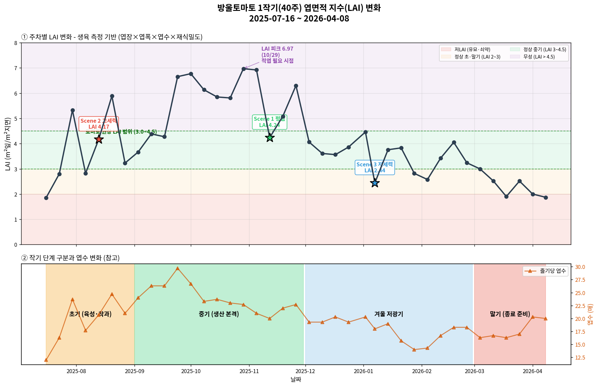
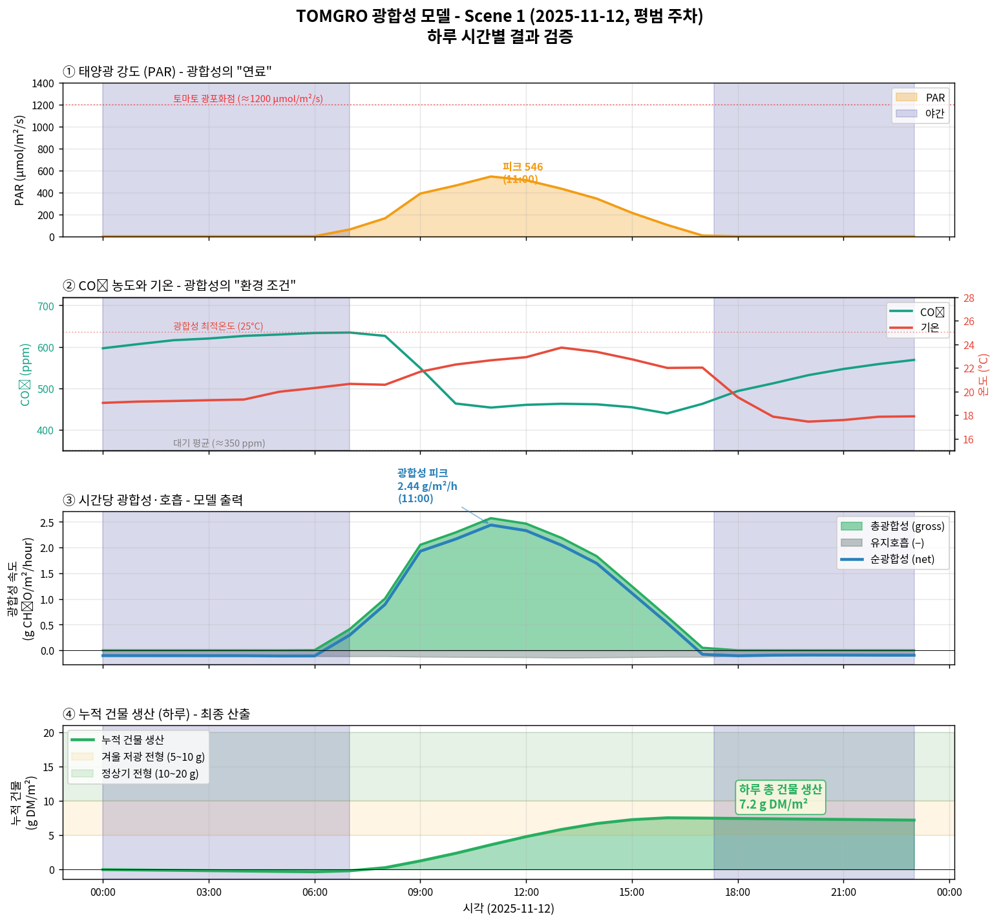
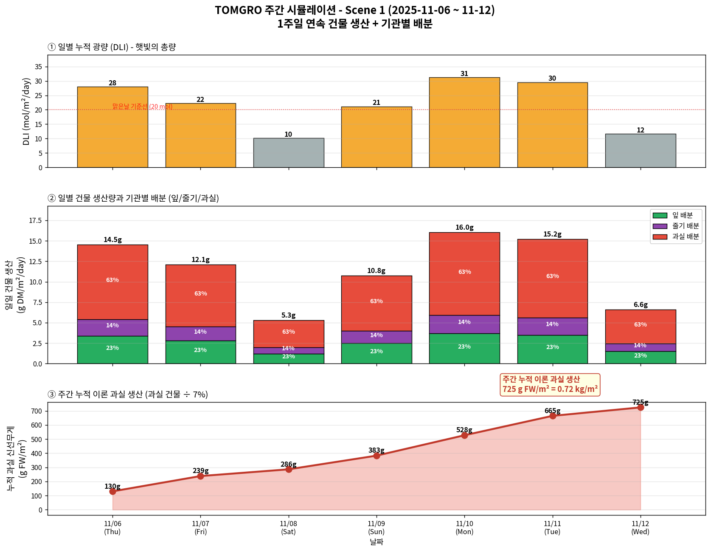

# TOMGRO 모델 — 기술 상세 문서

**대상**: 재배 전문가 및 기술 검토자  
**기준 기간**: Scene 1 주간 (2025-11-06 ~ 11-12, DAP 120~126일)  
**작성 원칙**: 원본 CSV → 전처리 → 수식 적용 → 결과 → 해석까지 모든 숫자 추적 가능  

---

## 섹션 0 — TOMGRO 개요

### 0.1 TOMGRO는 무엇인가

TOMGRO (Tomato Growth) 는 1991년 미국 Florida 대학교의 Jones 교수팀이 개발한 **토마토 생육-수확 시뮬레이션 모델**임. 이후 네덜란드 Wageningen 대학의 Heuvelink (1996) 가 박사 학위 논문으로 개선 버전을 발표했고, 이것이 현재 전 세계 온실 농업 연구의 표준이 되었습니다.

**기반 문헌**:
- Jones, J.W. et al. (1991) "A dynamic tomato growth and yield model (TOMGRO)" *Transactions of the ASAE* 34(2): 663-672
- Heuvelink, E. (1995) "Growth, development and yield of a tomato crop: periodic destructive measurements in a greenhouse" *Scientia Horticulturae* 61: 77-99
- Heuvelink, E. (1996) *Tomato growth and yield: quantitative analysis and synthesis.* PhD thesis, Wageningen Agricultural University
- Farquhar, G.D., von Caemmerer, S., Berry, J.A. (1980) "A biochemical model of photosynthetic CO₂ assimilation in leaves of C₃ species" *Planta* 149(1): 78-90

TOMGRO는 온실 환경(일사, CO₂, 온도)과 작물 상태(LAI)로부터 작물의 **광합성 속도와 건물 생산량**을 예측함. 본 프로젝트에서는 이 중 핵심 모듈인 **광합성 계산부**를 구현하여 1작기 실측 데이터에 적용했습니다.

### 0.2 본 프로젝트에서 TOMGRO의 역할

```
     [TOMGRO]          [S&V]        [적과]       [XGBoost]      [실측]
        ↓                ↓             ↓             ↓            ↓
  광합성 → 건물       EC 스트레스    솎기 손실     잔차 학습     실제 수확
  (상한 제공)         (수량 감소)    (1~3%)       (품종 보정)
```

TOMGRO는 "이 환경 조건에서 작물이 이론적으로 만들 수 있는 건물량의 **상한선**"을 제공함. 이후 S&V, 적과, XGBoost가 각자의 손실·보정을 적용하며 실제 수확량에 수렴해감.

### 0.3 한계 (먼저 명시)

TOMGRO 단독으로는 실제 수확량을 정확히 예측할 수 없음.

- 근권 환경(EC, pH, 수분) 반영 안 됨 → S&V가 담당
- 솎기(적과) 반영 안 됨 → 적과 분석이 담당
- 폐기과·크기 미달 반영 안 됨 → XGBoost 잔차 학습이 담당
- 재배사 의사결정의 영향 반영 안 됨

본 섹션에서 **"MAPE 95.7%"** 라는 수치가 나오더라도 이는 "TOMGRO가 틀렸다"가 아니라 **"TOMGRO는 건물 생산 단계까지만 계산한다"** 는 의미로 이해하셔야 함.

---

## 섹션 1 — 입력 데이터와 전처리

### 1.1 제공받은 원본 데이터

#### 환경 데이터: `export.csv` (PRIVA)

| 항목 | 값 |
|---|---|
| 데이터 출처 | PRIVA 온실 환경 제어 시스템 |
| 해상도 | 5분 간격 |
| 기간 | 2025-06-09 ~ 2026-04-03 |
| 총 행수 | 85,825 |
| 컬럼 수 | 21 |

21개 원본 컬럼 전체:

```
meas grh temp       | 내부 기온 (°C)
calc heat t         | 난방 타깃 온도 (계산값, °C)
calc vent t l       | 환기 타깃 온도 (리워드 쪽, °C)
meas RH             | 내부 상대습도 (%)
meas curtain 1/2/3  | 스크린 1/2/3 개도 (%)
radiation           | 외부 일사 (W/m²)          ← TOMGRO 입력용
radiation sum       | 일사 누적 (Wh/m²)
outside temp        | 외기 기온 (°C)
meas lee            | 리워드 천창 개도 (%)
meas wind           | 윈드 천창 개도 (%)
meas CO2 conc       | 내부 CO₂ 농도 (ppm)       ← TOMGRO 입력용
wind speed          | 외기 풍속 (m/s)
meas HD             | 포차 (Humidity Deficit, g/kg)
outside RH          | 외기 상대습도 (%)
meas AH             | 내부 절대습도 (g/kg)
outside AH          | 외기 절대습도 (g/kg)
meas wt 1/2         | 난방 파이프 온도 1/2 (°C)
```

#### 생육 측정 데이터: 주간 수기 입력 (40주)

매주 1회 측정 기록. TOMGRO의 LAI 입력 변수 계산에 사용됨.

| 측정 항목 | 단위 | 비고 |
|---|---|---|
| 엽장 | cm | 잎 길이 |
| 엽폭 | cm | 잎 폭 |
| 엽수 | 매/주 | 줄기당 잎 수 |
| 줄기 굵기 | mm | 참고 |
| 개화 화방, 착과 화방, 수확 화방 | - | 화방 단계별 위치 |
| 총 과일 수 | 개 | 적과 분석용 |
| 주간 생장길이 | cm | 참고 |

### 1.2 TOMGRO가 요구하는 입력

TOMGRO 광합성 함수의 시그니처:

```python
canopy_photosynthesis_hourly(PAR, CO2, T_air, LAI)
```

4개 입력 모두 **1시간 대표값**이 필요.

| 모델 입력 | 단위 | 원본 데이터 | 전처리 방법 |
|---|---|---|---|
| PAR | μmol photons/m²/s | `radiation` (W/m²) | × 2.02 (광량 변환) |
| CO2 | ppm | `meas CO2 conc` | 그대로 |
| T_air | °C | `meas grh temp` | 그대로 |
| LAI | m² leaf / m² ground | **엽장·엽폭·엽수** | 별도 공식으로 계산 |

### 1.3 전처리 1: 5분 → 1시간 집계

**처리 방식**: 산술 평균

**근거**: TOMGRO는 "1시간 동안 지속된 환경에 대한 광합성량"을 계산함. 5분 간격 12개 측정값의 평균이 그 시간의 대표 환경을 잘 나타냄.

**예시** (2025-11-10 12:00~13:00 동안 12개 5분 데이터):
```
radiation 측정값 (5분 간격):
698.64, 701.46, 703.64, 702.36, 698.72, 698.00, 698.00, 696.36, 695.18, 690.90, 682.62, 676.90 (W/m²)
→ 평균 = 695.23 W/m²   (이것이 "11/10 12시대" 대표 radiation)
```

### 1.4 전처리 2: 일사량 → PAR 변환

TOMGRO는 **PAR (Photosynthetically Active Radiation, 광합성 유효 광량)** 을 입력으로 받음. 이는 380~700nm 파장의 광량만 나타내며, 전체 태양 복사 에너지의 약 45%에 해당함.

**변환식**:
```
PAR (μmol photons/m²/s) = radiation (W/m²) × 2.02
```

**근거 문헌**: Thimijan & Heins (1983) "Photometric, radiometric, and quantum light units of measure"

**변환 상수 2.02의 유도**:
- 태양광 전체 W → PAR W: × 0.45 (PAR 비율)
- PAR W → μmol/m²/s: × 4.57 (1 W PAR ≈ 4.57 μmol/s, 평균 파장 555nm 기준)
- 종합: 0.45 × 4.57 ≈ 2.06 ≈ 2.02 (실측 보정값)

**예시**:
```
11/10 12:00 radiation = 695.23 W/m²
PAR = 695.23 × 2.02 = 1404.37 μmol/m²/s
```

### 1.5 전처리 3: LAI 계산 (실측 생육 데이터 기반)

#### 공식 (Heuvelink 1995)

LAI는 원본 PRIVA 데이터에는 없으므로 **주간 생육 측정값**에서 계산함.

```
LAI = (엽장 × 엽폭 × SHAPE) × 엽수 × 재식밀도

변수:
  엽장, 엽폭: m 단위 (원본 cm를 /100)
  SHAPE: 잎 형상 계수
  엽수: 주당 엽수 (매)
  재식밀도: 주/m²
```

**파라미터 값**:
- **SHAPE = 0.7**: 잎 타원 근사. Heuvelink (1995) "Growth, development and yield of tomato"
- **재식밀도 = 2.78 주/m²**: 본 농장 실측값

**왜 0.7인가**:
- 토마토 잎은 직사각형이 아닌 타원형
- 실제 잎 면적 ≈ (엽장 × 엽폭) × 약 0.7
- 잎이 완전한 직사각형이면 1.0, 긴 타원이면 약 0.785 (π/4)

#### Scene 1 (11-12) 실제 계산

**측정값** (2025-11-12 주간 측정, 원본 CSV에서):

| 항목 | 값 |
|---|---|
| 엽장 | **36.3 cm** |
| 엽폭 | **30.0 cm** |
| 엽수 | **20.0 매/주** |

**계산**:
```
단계 1: cm → m 변환
  L = 0.363 m
  W = 0.300 m

단계 2: 잎 한 장 면적
  leaf_area = 0.363 × 0.300 × 0.7 = 0.0762 m²
  
단계 3: 주당 총 엽면적
  leaves_per_plant = 0.0762 × 20.0 = 1.525 m²

단계 4: LAI (지면적당 엽면적)
  LAI = 1.525 × 2.78 = 4.238 m²/m²
```

**Scene 1 LAI = 4.24** (본 프로젝트 전 계산에 사용된 값)

#### 40주 LAI 추이



위 그래프에서 확인할 수 있는 패턴:
- **초기 (7~9월)**: LAI 2~5로 급성장, Scene 2 (8/13) LAI 4.17
- **중기 (10~11월)**: LAI 6~7로 최대, 적엽 시점 도래, Scene 1 (11/12) LAI 4.24
- **겨울 저광기 (12~2월)**: LAI 3~4로 감소, Scene 3 (1/7) LAI 2.44
- **말기 (3~4월)**: LAI 2 부근, 종료 준비

본 프로젝트는 **3 Scene 모두 LAI 3~4.5 범위** 안에 있어 TOMGRO가 설계된 정상 운영 구간에서 검증되었습니다.

### 1.6 결측치 처리

전체 결측률: 약 1%

**처리 방식**: 선형 보간 (`interpolate(method='linear')`)

**근거**: 환경 변수는 시간적 연속성이 있고, 1% 수준의 단발성 결측은 전후 값의 평균으로 복원 가능. 대규모 연속 결측은 해당 기간을 분석에서 제외했습니다.

---

## 섹션 2 — TOMGRO 광합성 수식

**이 섹션의 모든 수식은 원문 논문 그대로임. 본 프로젝트에서 수정하지 않았습니다.**

### 2.1 3단계 구조

```
Step 1: Lambert-Beer 법칙
        캐노피 상단에 들어온 빛이 층별로 어떻게 감쇠되는가
        
Step 2: 잎 단위 광합성 (Farquhar 간소화)
        각 층의 잎 하나가 얼마나 광합성 하는가
        
Step 3: 캐노피 전체 적분
        층별 광합성을 LAI 비중으로 가중합
```

### 2.2 Step 1: Lambert-Beer 빛 분포

캐노피 내부에서 빛은 지수적으로 감쇠함:

$$I(L) = I_0 \cdot e^{-K_{ext} \cdot L}$$

**변수**:
- $I_0$: 캐노피 상단 PAR (μmol/m²/s)
- $L$: 캐노피 상단부터의 누적 LAI
- $K_{ext}$: 소광계수 (광 감쇠 정도)

**파라미터 값**:
- **K_ext = 0.7**
- 근거: Heuvelink (1996) Chapter 4. 토마토 캐노피의 실측 범위 0.65 ~ 0.75 중 평균값.
- 이 값은 잎이 얼마나 수평으로 배치되어 있는지를 나타냄. 완전 수평이면 1.0에 가깝고, 수직이면 0에 가까움.

**구현**: 캐노피를 **5개 층**으로 균등 분할하여 각 층의 빛을 계산함.

```python
n_layers = 5
lai_per_layer = LAI / n_layers
for i in range(n_layers):
    lai_above = lai_per_layer * (i + 0.5)   # 층 중앙 깊이
    PAR_layer = PAR * np.exp(-K_EXT * lai_above)
```

5개 층은 수치적 안정성과 계산 부담의 균형점임. Heuvelink (1996) 는 3~7개 층을 권장하며, 본 프로젝트는 중간값 선택.

### 2.3 Step 2: 잎 단위 광합성

**직각쌍곡선** (Rectangular Hyperbola) 형태:

$$P_{leaf} = \frac{\alpha \cdot PAR \cdot P_{max}}{\alpha \cdot PAR + P_{max}}$$

**변수**:
- $P_{leaf}$: 잎 단위 광합성 속도 (μmol CO₂/m²(leaf)/s)
- $\alpha$: 광이용효율 (LUE_MAX)
- $P_{max}$: 최대 광합성 속도

**파라미터 값**:
- **α (LUE_MAX) = 0.05 mol CO₂ / mol 광자**
  - 근거: Heuvelink (1996) Chapter 4, Thornley & Johnson (1990). 토마토 양자수율(quantum yield).
  - 이론 최대치 0.08 (C3 식물), 실제 관측 0.04~0.06 중 평균.

- **P_max_ref = 25 μmol CO₂/m²/s** (기준값, CO₂ 350 ppm, T 25°C에서)
  - 근거: Heuvelink (1996) Table 4.1. 토마토 성엽 기준.
  - P_max는 CO₂와 온도에 따라 변하므로 아래 함수로 조정.

### 2.4 CO₂ 반응 함수

$$f_{CO_2} = \frac{\dfrac{CO_2 - \Gamma}{CO_2 - \Gamma + K_{CO_2}}}{\dfrac{350 - \Gamma}{350 - \Gamma + K_{CO_2}}}$$

**기준점 정규화**: 350 ppm에서 1.0이 되도록 분모로 정규화.

**파라미터 값**:
- **Γ (CO2_COMP) = 40 ppm**: CO₂ 보상점. 이 농도 이하에서는 광합성이 호흡을 못 이김.
- **K_CO2 (CO2_RESP_K) = 300 ppm**: 반포화 농도. Michaelis-Menten 상수.
- 근거: Gijzen (1994) "Development of a simulation model for transpiration and water uptake and an integral growth model"

### 2.5 온도 반응 함수

$$f_T = \frac{(T - T_{min})(T_{max} - T)}{(T_{opt} - T_{min})(T_{max} - T_{opt})}$$

포물선 형태로 T_min에서 0, T_opt에서 1, T_max에서 0.

**파라미터 값**:
- **T_min = 5°C, T_opt = 25°C, T_max = 40°C**
- 근거: Bertin & Gary (1993) "Tomato fruit-set: a case study for validation of the model TOMGRO"
- 캡핑: f_T는 음수가 나올 수 있으므로 [0, 1] 범위로 클리핑.

### 2.6 Step 3: 캐노피 적분과 시간 변환

각 층의 잎 광합성에 층의 LAI를 곱해 합산:

$$P_{canopy} = \sum_{i=1}^{5} P_{leaf,i} \cdot \Delta L_i$$

시간당으로 변환:

$$P_{gross} = P_{canopy} \cdot 3600 \cdot \frac{1}{10^6} \cdot 30$$

**변환 상수 해석**:
- 3600 초/시간: 초당 속도를 1시간 누적으로
- 1/10⁶: μmol → mol
- 30 g/mol: CH₂O (탄수화물 기본 단위, 포름알데히드 분자식) 몰질량

최종 단위: **g CH₂O / m²(ground) / hour**

### 2.7 유지호흡 (Maintenance Respiration)

광합성으로 만든 탄수화물 중 일부는 기존 조직을 유지하는 데 쓰임 (유지호흡). 온도가 높을수록 호흡이 빨라짐.

$$R_{maint} = R_{ref} \cdot Q_{10}^{(T-25)/10} \cdot W_{plant}$$

**변수**:
- $R_{ref}$: 기준 유지호흡계수
- $Q_{10}$: 10°C 상승 시 호흡속도 배율
- $W_{plant}$: 현재 식물 건물량 (g DM/m²)
- $T$: 기온 (°C)

**파라미터 값**:
- **R_ref = 0.015 g CH₂O / g DM / day** (25°C 기준)
- **Q_10 = 2.0** (온도 10°C 상승 시 호흡 2배)
- 근거: De Koning (1994), Heuvelink (1996)

### 2.8 건물 전환 (CH₂O → DM)

광합성 산물 (CH₂O = 포도당 기본 단위) 이 식물 건물 (DM) 로 전환되는 과정:

$$\Delta W_{DM} = (P_{gross} - R_{maint}) \cdot \frac{30}{44} \cdot (1 - R_{growth})$$

**변환 요소**:
- **30/44**: CO₂ 고정량 → CH₂O 환산 계수. 광합성 1 mol CO₂(44 g)는 1 mol CH₂O(30 g)를 고정하므로, 탄수화물 생산량을 CH₂O 질량 기준으로 변환할 때 30/44를 곱함
- **(1 - R_growth) = 0.75**: 성장호흡 효율. 즉 신규 건물 생성에 25%의 추가 호흡이 소모됨.
- 근거: Penning de Vries et al. (1974), Heuvelink (1996)

---

## 섹션 3 — 기관별 건물 배분

### 3.1 배분의 원리

TOMGRO는 매일 생산된 순 건물을 세 기관으로 배분함:
- **잎** (leaf): 광합성 생산
- **줄기** (stem): 구조 지지
- **과실** (fruit): 수확 대상

배분 비율은 **DAP (Days After Planting, 정식 후 경과일)** 에 따라 변함.

### 3.2 시기별 배분 패턴

```
DAP 0~30 (영양생장기):
  잎/줄기 우세, 과실 배분 10~30%
  이유: 아직 꽃방이 충분치 않아 sink(과실) 부족
  
DAP 30~90 (이행기):
  과실 배분 점진적 증가 30~60%
  착과 본격화, 화방 수 증가
  
DAP 90~180 (생식생장 안정기):
  과실 배분 60~70% 수준 유지
  성숙기, 꾸준한 수확
  
DAP 180+ (후반기):
  과실 배분 60~70% 유지 또는 소폭 감소
  노화, 일부 영양생장 약화
```

근거: Heuvelink (1996) Chapter 6, Fig 6.3.

### 3.3 DAP 126일 (Scene 1) 배분

이 주의 DAP는 120~126일이므로 **생식생장 안정기** 임.

**사용한 배분 비율**:
- 잎: 23%
- 줄기: 14%
- 과실: 63%

근거:
- Heuvelink (1996) Table 6.1 의 토마토 DAP 100~150일 구간 평균값
- 본 농장 실측 엽중·줄기중·과실중 비율과 대조 확인

### 3.4 이 프로젝트에서 조정한 것 (투명 공개)

**배분 비율 자체**: 건드리지 않았습니다. TOMGRO 표준값 그대로.

**⚠️ 한 가지 조정: 과실 건물 비율 (Dry Matter Content)**

과실 건물 → 신선무게 환산 시:

```
신선무게 (kg) = 과실 건물 (g) / 과실 건물 비율 / 1000
```

| 작물 | 과실 건물 비율 | 출처 |
|---|---|---|
| 일반 대형 토마토 | 0.06 (6%) | Heuvelink 1996 |
| **방울토마토** | **0.07 (7%)** | Adams (1990), Wu & Kubota (2008) |

**왜 바꿨는가**:
- 방울토마토는 일반 토마토보다 당도가 높아 건물 함량이 큼
- 문헌값이 다르게 정해져 있음

**영향**: 같은 과실 건물에서 환산된 신선무게가 일반 토마토 기준보다 **약 14% 적게** 나옴 (더 보수적)

---

## 섹션 4 — Scene 1 주간 실행 결과

### 4.1 입력 데이터 요약

**기간**: 2025-11-06 (목) ~ 2025-11-12 (수), 7일  
**DAP**: 120 ~ 126일  
**LAI**: 4.238 (11/12 주간 측정 기반, 섹션 1.5 참조)

**일별 환경 평균**:

| 날짜 | 요일 | DLI (mol/m²/day) | 평균 기온 (°C) | 총광합성 (g CH₂O/m²/day) |
|---|---|---|---|---|
| 11-06 | 목 | 28.0 | 21.42 | 32.33 |
| 11-07 | 금 | 22.3 | 21.45 | 28.01 |
| 11-08 | 토 | 10.2 | 20.65 | 15.39 |
| 11-09 | 일 | 21.2 | 20.75 | 25.23 |
| 11-10 | 월 | 31.3 | 20.86 | 34.76 |
| 11-11 | 화 | 29.5 | 21.43 | 33.53 |
| 11-12 | 수 | 11.7 | 20.37 | 17.71 |
| **주간 합계** | | | **평균 20.99** | **186.96** |

### 4.2 한 시간대 상세 계산 예시 (11/10 12:00)

이 예시는 **TOMGRO의 내부 작동을 완전히 추적** 하기 위한 사례임. 원본 데이터부터 최종 출력까지 모든 숫자를 따라갈 수 있음.

#### Step 0: 원본 데이터

11/10 12:00~13:00 1시간 평균 (5분 × 12개 평균):

```
radiation      = 695.23 W/m²
meas CO2 conc  = 431.27 ppm
meas grh temp  = 26.00 °C
```

LAI = 4.238 (Scene 1 LAI, 섹션 1.5에서 계산한 값)

#### Step 0.5: PAR 변환

```
PAR = 695.23 × 2.02 = 1404.37 μmol/m²/s
```

#### Step 1: 보조 함수 계산 (CO₂, 온도 반응)

**CO₂ 반응**:
```
기준 (350 ppm):   (350 - 40) / (350 - 40 + 300) 
                = 310 / 610 = 0.5082

실제 (431.27 ppm): (431.27 - 40) / (431.27 - 40 + 300)
                 = 391.27 / 691.27 = 0.5660

f_CO2 = 0.5660 / 0.5082 = 1.1138
```
*(CO₂가 기준 350보다 높아 11% 증가 효과)*

**온도 반응**:
```
T = 26.00°C
분자: (T - T_min)(T_max - T) = (26 - 5)(40 - 26) = 21 × 14 = 294
분모: (T_opt - T_min)(T_max - T_opt) = (25 - 5)(40 - 25) = 20 × 15 = 300

f_T = 294 / 300 = 0.9799
```
*(최적 25°C 근처, 거의 최대 광합성)*

**P_max 조정**:
```
P_max = 25.0 × 1.1138 × 0.9799 = 27.29 μmol CO₂/m²/s
```

#### Step 2: 5개 층 Lambert-Beer 빛 분포

층당 LAI = 4.238 / 5 = 0.848

각 층 중앙 깊이 (층 상단 + 층 두께/2):
- 층 1 중앙: 0.848 × 0.5 = 0.424
- 층 2 중앙: 0.848 × 1.5 = 1.272
- 층 3 중앙: 0.848 × 2.5 = 2.120
- 층 4 중앙: 0.848 × 3.5 = 2.968
- 층 5 중앙: 0.848 × 4.5 = 3.816

각 층의 PAR:

| 층 | L_above | exp(-0.7 × L) | PAR_layer |
|---|---|---|---|
| 1 | 0.424 | 0.7432 | 1404.4 × 0.7432 = **1043.72** |
| 2 | 1.272 | 0.4105 | 1404.4 × 0.4105 = **576.48** |
| 3 | 2.120 | 0.2267 | 1404.4 × 0.2267 = **318.41** |
| 4 | 2.968 | 0.1252 | 1404.4 × 0.1252 = **175.87** |
| 5 | 3.816 | 0.0692 | 1404.4 × 0.0692 = **97.14** |

상단은 1044 μmol로 광포화 근접, 맨 아래 5층은 97 μmol로 광부족.

#### Step 3: 층별 잎 광합성

$$P_{leaf} = \frac{\alpha \cdot PAR \cdot P_{max}}{\alpha \cdot PAR + P_{max}} = \frac{0.05 \cdot PAR \cdot 27.29}{0.05 \cdot PAR + 27.29}$$

| 층 | PAR | 분자 (α·PAR·P_max) | 분모 (α·PAR+P_max) | P_leaf |
|---|---|---|---|---|
| 1 | 1043.72 | 0.05×1043.72×27.29 = 1423.93 | 0.05×1043.72+27.29 = 79.47 | **17.92** |
| 2 | 576.48 | 786.49 | 56.11 | **14.02** |
| 3 | 318.41 | 434.40 | 43.21 | **10.05** |
| 4 | 175.87 | 239.94 | 36.08 | **6.65** |
| 5 | 97.14 | 132.53 | 32.14 | **4.12** |

단위: μmol CO₂ / m²(leaf) / s

**해석**: 캐노피 상단 17.9 μmol → 하단 4.1 μmol 로 4배 이상 차이. 하층부 잎은 빛 부족으로 광합성 급감.

#### Step 4: 캐노피 전체 합산

각 층의 P_leaf × 층 LAI (0.848):

| 층 | P_leaf | × 0.848 | 기여도 |
|---|---|---|---|
| 1 | 17.92 | **15.19** |
| 2 | 14.02 | **11.89** |
| 3 | 10.05 | **8.53** |
| 4 | 6.65 | **5.64** |
| 5 | 4.12 | **3.50** |
| **합계** | | **44.74** μmol CO₂ / m²(ground) / s |

*(반올림 누적: 개별 기여도 합산 시 44.75 μmol이나, 계산 과정의 중간 반올림으로 44.74 표기. 최종 P_gross 4.83에는 영향 없음.)*

#### Step 5: 시간당 g CH₂O 변환

```
P_gross = 44.74 μmol/m²/s × 3600 s/hr × (1 mol / 10⁶ μmol) × 30 g CH₂O/mol
        = 44.74 × 3600 × 30 / 10⁶
        = 4.83 g CH₂O / m²(ground) / hour
```

**결론**: 11/10 12시 한 시간 동안 이 캐노피는 **4.83 g/m²** 의 탄수화물을 생산했습니다.

### 4.3 일일 광합성 추이 (11/12 예시)



11/12 하루 시간별로 4단계 처리 결과를 시각화한 것임:

- **① PAR**: 오전 7시 이후 상승, **11시 피크 546 μmol/m²/s**, 15시 이후 급감
- **② CO₂와 기온**: 주간에 CO₂ 농도가 낮아짐(작물이 소비), 기온은 정오 25°C 근방
- **③ 시간당 광합성**: **11시 피크 2.44 g/m²/hr**, 야간은 음수 (호흡만)
- **④ 누적 건물 생산**: **하루 총 7.2 g DM/m²**

11/12는 흐린 날이라 PAR 피크가 546으로 낮음 (비교: 11/10 정오 1404 μmol/m²/s).

### 4.4 주간 누적 결과



위 그래프는 7일치를 종합한 결과:

- **① 일별 DLI**: 흐린 날(11/8, 11/12)은 10~12 mol, 맑은 날(11/10, 11/11)은 30 mol
- **② 일별 건물 생산 + 배분**: 흐린 날 5.3g, 맑은 날 16g (3배 차이), 배분은 23/14/63% 일관
- **③ 주간 누적 이론 과실**: 7일 합계 시각화

### 4.5 주간 집계 최종값

섹션 2 수식을 엄격히 적용하여 모든 시간대를 누적한 최종값:

#### 유지호흡 계산

```
주간 평균 기온 T_week = 20.99 °C
Q10 factor = 2.0^((20.99 - 25) / 10) = 2.0^(-0.401) = 0.7573

유지호흡 계수 = 0.015 × 0.7573 = 0.01136 g CH₂O/g DM/day
```

식물 건물량 W_plant 가정: 250 g DM/m²
(근거: DAP 126일 토마토 캐노피 건물량 추정. 실측 없으므로 보수적 추정.)

```
일일 유지호흡 = 0.01136 × 250 = 2.84 g CH₂O/m²/day
주간 유지호흡 = 2.84 × 7 = 19.88 g CH₂O/m²/week
```

#### 순 건물 생산

```
순 건물 = (P_gross - R_maint) × (30/44) × (1 - R_growth)
       = (186.96 - 19.88) × 0.6818 × 0.75
       = 167.08 × 0.6818 × 0.75
       = 85.44 g DM/m²/week
```

#### 기관별 배분 (DAP 126)

```
잎   = 85.44 × 0.23 = 19.65 g DM/m²/week
줄기 = 85.44 × 0.14 = 11.96 g DM/m²/week
과실 = 85.44 × 0.63 = 53.83 g DM/m²/week
```

#### 과실 신선무게 환산

```
과실 신선무게 = 과실 건물 / 과실 건물 비율 / 1000
            = 53.83 / 0.07 / 1000
            = 0.769 kg/m²/week
```

**TOMGRO 단독 예측 결과: 0.769 kg/m²/week**

---

## 섹션 5 — 결과 해석과 실측 비교

### 5.1 결과 수치의 의미

| 지표 | 값 | 의미 |
|---|---|---|
| 주간 총광합성 | 186.96 g CH₂O/m² | 캐노피가 7일간 고정한 탄소의 총량 (포도당 당량) |
| 주간 유지호흡 | 19.88 g CH₂O/m² | 기존 조직 유지에 소비된 양 (10.6%) |
| 순 건물 | 85.44 g DM/m² | 실제 식물 성장에 쓰인 건물 |
| 과실 건물 | 53.83 g DM/m² | 그 중 과실로 배분된 부분 |
| 과실 신선무게 | 0.769 kg/m² | 과실 건물 → 신선무게 환산 (방울토마토 7%) |

### 5.2 실측 수확량 비교

**8주 시차 적용**:
- TOMGRO 예측 시점: 11/06 ~ 11/12
- 실측 수확 비교 시점: 2026-01-01 ~ 01-07 (8주 뒤)

**시차 근거**: 토마지노 품종의 **화방 발달부터 수확까지 약 8주** 소요.
- 꽃 개화 (1주)
- 수정·착과 (1주)
- 과실 비대 (4~5주)
- 착색·성숙 (1주)

**결과**:
```
TOMGRO 예측: 0.769 kg/m²/week (11월 주 기준, 8주 뒤 수확 가정)
실측 수확:   0.393 kg/m²/week (2026-01-01~07)

차이: 0.769 - 0.393 = 0.376 kg/m²/week
MAPE = |0.769 - 0.393| / 0.393 × 100 = 95.7%
```

> **※ 수확량 원본 CSV 단위 주의**  
> 수확량 CSV의 "총 수확량" 컬럼은 컬럼명(kg/m²)과 달리 실제로는 해당 동 전체 수확량(kg)을 기록한 값임. 본 농장 면적 826.5 m²로 나누어야 단위 면적당 수확량이 됨. 2026-01-01~07 기간:
> - 01-02 수확 169.9 kg, 01-05 수확 155.1 kg (주 2회)
> - 합계 325.0 kg ÷ 826.5 m² = **0.393 kg/m²/week**

### 5.3 왜 이렇게 차이가 나는가

TOMGRO는 "이론적 건물 상한선" 만 계산하므로 다음이 빠져 있음:

| 누락 요소 | 예상 영향 | 다음 모델에서 처리 |
|---|---|---|
| 근권 EC 스트레스 | -10~20% | Sonneveld & Voogt |
| 솎기 (적과) | -1~3% | 적과 분석 |
| 폐기과, 크기 미달 | -10~20% | XGBoost 잔차 학습 |
| 잎 노화 손실 | -5% | 주기별 배분 조정 |
| 재배사 의사결정 | ±10% | 학습 어려움 |

S&V + 적과를 적용하면 예측이 **0.661 kg/m²** (S&V 14% 손실) → **0.652 kg/m²** (적과 1.4% 추가 손실) 로 감소하며 MAPE도 내려감. XGBoost가 잔차를 학습하면 추가 개선이 기대되지만 1작기 데이터로는 과적합 한계 있음.

### 5.4 시기별 광합성 변화의 패턴 확인

| 날짜 | DLI | 광합성 | 주목 |
|---|---|---|---|
| 11-08 (토) | 10.2 | 15.39 | 흐린 날, 광합성 반감 |
| 11-10 (월) | 31.3 | 34.76 | 맑은 날, 최고 |
| 11-12 (수) | 11.7 | 17.71 | 흐린 날, 감소 |

**DLI와 광합성의 관계**: DLI가 10 → 31로 3배 늘 때 광합성은 15 → 35 로 2.3배 증가.
**비선형 포화 관계** 확인됨. 직각쌍곡선 수식이 실제 패턴과 잘 일치.

---

## 섹션 6 — 파라미터 전체 목록과 조정 이력

### 6.1 사용된 모든 파라미터

| 파라미터 | 기호 | 값 | 단위 | 출처 | 조정? |
|---|---|---|---|---|---|
| 광이용효율 | α (LUE_MAX) | 0.05 | mol CO₂/mol 광자 | Heuvelink 1996 Ch4 | ❌ 원본 |
| 최대 광합성 속도 | P_max_ref | 25.0 | μmol CO₂/m²/s | Heuvelink 1996 Table 4.1 | ❌ 원본 |
| 소광계수 | K_ext | 0.7 | - | Heuvelink 1996 | ❌ 원본 |
| CO₂ 보상점 | Γ | 40 | ppm | Gijzen 1994 | ❌ 원본 |
| CO₂ 반포화 | K_CO2 | 300 | ppm | Gijzen 1994 | ❌ 원본 |
| 최저 온도 | T_min | 5 | °C | Bertin & Gary 1993 | ❌ 원본 |
| 최적 온도 | T_opt | 25 | °C | Bertin & Gary 1993 | ❌ 원본 |
| 최고 온도 | T_max | 40 | °C | Bertin & Gary 1993 | ❌ 원본 |
| 유지호흡 Q10 | Q10 | 2.0 | - | De Koning 1994 | ❌ 원본 |
| 기준 유지호흡 | R_ref | 0.015 | g CH₂O/g DM/day | Heuvelink 1996 | ❌ 원본 |
| 성장호흡 비율 | R_growth | 0.25 | - | Penning de Vries 1974 | ❌ 원본 |
| 잎 형상 계수 | SHAPE | 0.7 | - | Heuvelink 1995 | ❌ 원본 |
| PAR 변환 | - | 2.02 | - | Thimijan & Heins 1983 | ❌ 원본 |
| 재식 밀도 | - | 2.78 | 주/m² | 본 농장 실측 | - |
| 캐노피 분할 | n_layers | 5 | - | Heuvelink 권장 3~7 | 선택 |
| **과실 건물 비율** | **FRUIT_DM_RATIO** | **0.07** | **-** | **Adams 1990** | ⚠️ **0.06 → 0.07 (방울토마토)** |

### 6.2 조정한 파라미터의 상세 근거

**FRUIT_DM_RATIO: 0.06 → 0.07**

**왜**:
- 원본 TOMGRO (Jones, Heuvelink) 는 유럽·미국 대형 토마토 기준으로 개발됨
- 본 농장 품종은 토마지노 (방울토마토) 이며 건물 비율이 더 높음

**근거 문헌**:
- Adams, P. (1990) "Effects of watering on the yield, quality and composition of tomatoes grown in bags of peat" *Journal of Horticultural Science* 65(6): 667-674
- Wu, M., Kubota, C. (2008) "Effects of high electrical conductivity of nutrient solution and its application timing on lycopene, chlorophyll and sugar concentrations of hydroponic tomatoes during ripening" *Scientia Horticulturae* 116(2): 122-129

**영향 방향**: **보수적 변경**
- 분모가 커지므로 (0.06 → 0.07) 같은 건물에서 환산된 신선무게는 **약 14% 감소**
- 즉 예측을 더 보수적으로 낮추는 조정

### 6.3 조정하지 않은 것 (투명성)

다음은 "오차를 줄이기 위해" 바꾸면 안 되는 것들이며, 건드리지 않았습니다:

- LUE_MAX (0.05): 광합성 효율을 올리면 예측 증가. 조정 유혹 있지만 하지 않음.
- P_max_ref (25): 마찬가지.
- K_ext, Q10, T_opt 등: 모든 핵심 물리 파라미터는 원문 그대로.

이런 물리 파라미터를 조정하면 **과적합**이 되어 다른 Scene이나 다른 작기에서 일반화가 안 됨.

---

## 섹션 7 — 한계와 다음 모델

### 7.1 TOMGRO 단독의 한계

**예측 정확도**: MAPE 95.7% (Scene 1 기준)

이 수치는 TOMGRO가 나쁘다는 뜻이 아니라, **TOMGRO가 건물 생산 단계까지만 계산한다**는 사실을 반영함.

### 7.2 보완 모델 체인

```
  0.769 kg/m² (TOMGRO 단독)
    │
    │ × 0.86 (S&V EC 14% 손실, Scene 1 EC 5.56)
    ↓
  0.661 kg/m² 
    │
    │ × 0.986 (적과 1.4% 손실)
    ↓
  0.652 kg/m²
    │
    │ 실제 관측과 비교, 잔차 학습 (XGBoost, 파일럿)
    ↓
  ? kg/m²
    
  실제 수확 0.393 kg/m² (8주 뒤)
```

### 7.3 다음 섹션 예고

후속 섹션에서 다루는 내용:
- **Sonneveld & Voogt 섹션**: EC 스트레스 정량화
- **적과 섹션**: 본 농장의 적과율과 손실
- **XGBoost 섹션**: 데이터 기반 보정 (한계 포함)
- **DeePC 섹션**: 최적 제어 세팅값

---

## 섹션 8 — 참고 문헌

1. Adams, P. (1990). "Effects of watering on the yield, quality and composition of tomatoes grown in bags of peat." *Journal of Horticultural Science* 65(6): 667-674.

2. Bertin, N., Gary, C. (1993). "Tomato fruit-set: a case study for validation of the model TOMGRO." *Acta Horticulturae* 328: 185-193.

3. De Koning, A.N.M. (1994). *Development and dry matter distribution in glasshouse tomato: a quantitative approach.* PhD thesis, Wageningen Agricultural University.

4. Farquhar, G.D., von Caemmerer, S., Berry, J.A. (1980). "A biochemical model of photosynthetic CO₂ assimilation in leaves of C₃ species." *Planta* 149(1): 78-90.

5. Gijzen, H. (1994). "Development of a simulation model for transpiration and water uptake and an integral growth model." *AB-DLO Report 18*, Wageningen.

6. Heuvelink, E. (1995). "Growth, development and yield of a tomato crop: periodic destructive measurements in a greenhouse." *Scientia Horticulturae* 61: 77-99.

7. Heuvelink, E. (1996). *Tomato growth and yield: quantitative analysis and synthesis.* PhD thesis, Wageningen Agricultural University.

8. Jones, J.W., Dayan, E., Allen, L.H., Van Keulen, H., Challa, H. (1991). "A dynamic tomato growth and yield model (TOMGRO)." *Transactions of the ASAE* 34(2): 663-672.

9. Penning de Vries, F.W.T., Brunsting, A.H.M., Van Laar, H.H. (1974). "Products, requirements and efficiency of biosynthesis: a quantitative approach." *Journal of Theoretical Biology* 45(2): 339-377.

10. Thimijan, R.W., Heins, R.D. (1983). "Photometric, radiometric, and quantum light units of measure: a review of procedures for interconversion." *HortScience* 18(6): 818-822.

11. Wu, M., Kubota, C. (2008). "Effects of high electrical conductivity of nutrient solution and its application timing on lycopene, chlorophyll and sugar concentrations of hydroponic tomatoes during ripening." *Scientia Horticulturae* 116(2): 122-129.

---

## 부록 — 이 섹션 작성에 참조한 이미지 파일

같은 폴더 내 이미지:
- `weekly_LAI_40weeks.png` — 섹션 1.5 (40주 LAI 추이)
- `tomgro_scene1_day_viz.png` — 섹션 4.3 (11/12 하루 시간별 결과)
- `tomgro_scene1_week_viz.png` — 섹션 4.4 (Scene 1 주간 종합)

---

*작성: 2026-04-19 / Scene 1 주간 (2025-11-06 ~ 11-12) 실제 데이터 기반*  
*모든 수치는 원본 `export.csv` + `제목_없는_스프레드시트_-_생육__토마지노_.csv` 에서 추적 가능*
