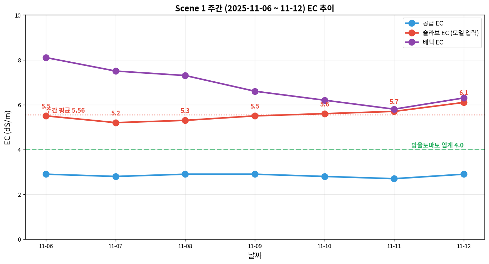
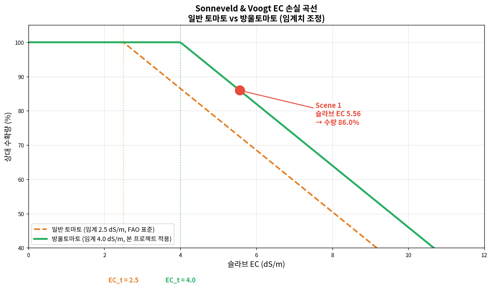
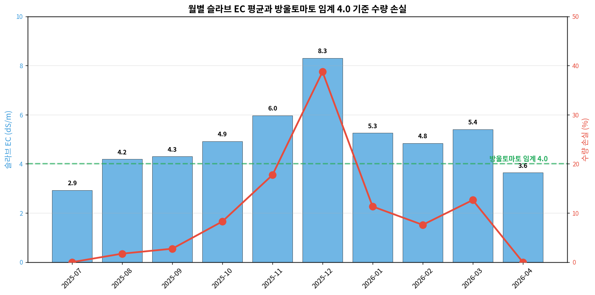

# Sonneveld & Voogt 모델 — 기술 상세 문서

**대상**: 재배 전문가 및 기술 검토자  
**기준 기간**: Scene 1 주간 (2025-11-06 ~ 11-12)  
**작성 원칙**: 원본 CSV → 전처리 → 수식 적용 → 결과 → 해석까지 모든 숫자 추적 가능

---

## 섹션 0 — Sonneveld & Voogt 개요

### 0.1 S&V 모델은 무엇인가

Sonneveld & Voogt 모델은 **근권 EC(전기전도도) 스트레스에 의한 작물 수량 감소를 정량화하는 물리-통계 모델**임. 네덜란드 Wageningen 대학과 IMAG(Institute for Agricultural Engineering)의 공동 연구로 1980년대부터 축적되었으며, Sonneveld & Voogt (2009) 가 종합 정리하여 현재 FAO의 온실 작물 염류 스트레스 평가 국제 표준으로 사용됨.

**기반 문헌**:
- Sonneveld, C., Voogt, W. (2009) *Plant Nutrition of Greenhouse Crops*. Springer, Chapter 6 "Salinity"
- Shannon, M.C., Grieve, C.M. (1999) "Tolerance of vegetable crops to salinity" *Scientia Horticulturae* 78: 5-38
- Maas, E.V., Hoffman, G.J. (1977) "Crop salt tolerance - Current assessment" *Journal of Irrigation and Drainage Division* 103: 115-134
- FAO (2002) *Irrigation and Drainage Paper No. 61: Crop Evapotranspiration*

### 0.2 본 프로젝트에서 S&V의 역할

```
   [TOMGRO]        [S&V]         [적과]      [XGBoost]    [실측]
      ↓              ↓              ↓            ↓          ↓
  광합성 → 건물   EC 스트레스    솎기 손실    잔차 학습   실제 수확
 (이론 상한선)   (수량 감소)   (1~3% 손실)  (품종 보정)
                    ↑
              본 섹션 담당
```

S&V는 **TOMGRO가 산출한 이론 수량에 근권 EC 스트레스 손실을 차감** 하는 역할임. 본 농장처럼 고당도 재배 전략을 쓰는 곳은 EC를 의도적으로 높게 운영하므로 S&V 손실 평가가 특히 중요.

### 0.3 한계 (먼저 명시)

- **평균 EC 기반 선형 모델임**: 일중 변동, 급격 변화 반영 안 됨
- **EC 외 요인 반영 안 됨**: pH, 온도, 습도와의 상호작용 없음  
- **품종 특성 간접 반영**: 임계 EC 조정으로만 품종 차이 반영

MAPE 판단은 TOMGRO와 결합 후 (섹션 5) 에서 논의.

---

## 섹션 1 — 입력 데이터와 전처리

### 1.1 제공받은 원본 데이터

#### 관수·양액 데이터: `토마지노_수확량_및_관수_관리_-_환경__토마지노_.csv`

| 항목 | 값 |
|---|---|
| 데이터 출처 | 본 농장 일일 관수 관리 기록 |
| 해상도 | 1일 1회 (측정 있는 날만) |
| 기간 | 2025-07-09 ~ 2026-04-03 |
| 유효 EC 측정일 | 269일 |
| 컬럼 수 | 22 |

22개 원본 컬럼:

```
일일 총 관수량 (mL/m2)     배액량 (mL/m2)
일일 관수 횟수 (회)         배액률 (%)
J당 관수량 (ml/J)          J당 흡수량 (ml/J)
Cal J당 관수량 (ml/J)       Cal J당 흡수량 (ml/J)
첫 관수전 함수량 (%)         한낮 함수량 (%)
델타 WC (%)
공급 EC (mS/cm)           ← S&V 입력 후보 1
공급 pH
슬라브 EC (mS/cm)          ← S&V 입력 (실제 사용)
슬라브 pH
배액 EC (mS/cm)            ← S&V 입력 후보 3
배액 pH
총 수확량 (kg/m2)           ← 실측 비교용 (섹션 5)
평균 과중 (g)
Waste (kg/m2)
일출 시간
일몰 시간
```

### 1.2 S&V가 요구하는 입력

```python
relative_yield(slab_ec)
```

단일 입력 함수. **슬라브 EC 1개 값** 만으로 작동함.

### 1.3 전처리 1: 세 가지 EC 중 슬라브 EC 선택

본 농장에는 EC 측정 지점이 3곳 있음:

| EC 종류 | 측정 위치 | Scene 1 주간 평균 |
|---|---|---|
| 공급 EC | 양액기 공급 라인 | 2.84 dS/m |
| 슬라브 EC | 근권(슬라브 내부) | **5.56 dS/m** |
| 배액 EC | 배액 라인 | 6.83 dS/m |

**S&V에 슬라브 EC를 쓰는 이유**:

FAO Irrigation and Drainage Paper No. 61 및 Sonneveld & Voogt (2009) 는 모두 **근권(root zone) EC** 를 입력으로 함. 이유:

- 식물 뿌리가 실제로 흡수하는 물의 염류 농도는 슬라브 내부
- 공급 EC는 식물이 본 것이 아니라 시설이 본 값
- 배액 EC는 이미 뿌리 통과 후 농축된 값

**세 EC가 다른 이유**: 온실 재배에서 식물은 물만 선택적으로 흡수하고 염류는 남기므로, **공급 → 슬라브 → 배액** 순서로 EC가 농축됨. 본 농장에서 확인되는 2.84 → 5.56 → 6.83 dS/m 패턴은 정상 관수·배액 시스템의 전형적 모습임.

### 1.4 전처리 2: 결측치 처리

- 전체 296일 중 측정 있는 날: 269일
- 결측일: 27일 (약 9%)
- 처리 방식: **보간 없이 측정일만 사용**

**근거**: 관수 관리는 재배사의 수동 측정·기록이며, 결측이 주말/휴일 등 의도적 비측정일 수 있음. 보간이 오히려 데이터 왜곡 위험.

### 1.5 Scene 1 주간 EC 실측값



| 날짜 | 공급 EC | 슬라브 EC | 배액 EC | 배액률 |
|---|---|---|---|---|
| 11-06 | 2.9 | 5.5 | 8.1 | 30.0% |
| 11-07 | 2.8 | 5.2 | 7.5 | 35.3% |
| 11-08 | 2.9 | 5.3 | 7.3 | 23.2% |
| 11-09 | 2.9 | 5.5 | 6.6 | 29.9% |
| 11-10 | 2.8 | 5.6 | 6.2 | 25.0% |
| 11-11 | 2.7 | 5.7 | 5.8 | 33.3% |
| 11-12 | 2.9 | 6.1 | 6.3 | 10.0% |
| **평균** | **2.84** | **5.56** | **6.83** | **26.7%** |

주간 평균 슬라브 EC **5.56 dS/m**가 이 주의 S&V 입력값.

---

## 섹션 2 — S&V 수량 감소 수식

**이 섹션의 수식은 원문 그대로임. 본 프로젝트에서 수정하지 않음.**

### 2.1 선형 감소 모델

Sonneveld & Voogt (2009), Maas & Hoffman (1977) 의 고전 식:

$$Y_r = \begin{cases} 1 & \text{if } EC_w \le EC_t \\ 1 - b \cdot (EC_w - EC_t) & \text{if } EC_w > EC_t \end{cases}$$

**변수**:
- $Y_r$: 상대 수확량 (0~1 사이, 1 = 손실 없음)
- $EC_w$: 슬라브 EC (dS/m)
- $EC_t$: 임계 EC (threshold)
- $b$: 단위 EC당 수량 감소율 (slope)

**해석**:
- EC가 임계치 이하면 손실 없음 (Y_r = 1)
- 임계치 초과 시 초과분 × 기울기 만큼 손실
- 완전 손실 (Y_r = 0) 이 되는 EC는 EC_t + 1/b

### 2.2 파라미터 값 (일반 토마토 원본)

| 파라미터 | 기호 | 값 | 출처 |
|---|---|---|---|
| 임계 EC | $EC_t$ | **2.5 dS/m** | Sonneveld & Voogt 2009, FAO 2002 |
| 기울기 | $b$ | **0.09** (9%/dS/m) | Shannon & Grieve 1999 |

즉 일반 토마토는 EC가 2.5 초과하면 1 dS/m 늘 때마다 수량이 9% 감소.

**예시** (일반 토마토, EC = 6.0):
```
Y_r = 1 - 0.09 × (6.0 - 2.5) = 1 - 0.315 = 0.685
수량 손실: 31.5%
```

### 2.3 방울토마토 파라미터 조정 (본 프로젝트 적용)

**⚠️ 본 프로젝트에서 임계치만 조정함. 기울기는 그대로.**

| 파라미터 | 일반 토마토 | 방울토마토 (본 프로젝트) | 조정 근거 |
|---|---|---|---|
| $EC_t$ | 2.5 dS/m | **4.0 dS/m** | Wu & Kubota (2008), De Pascale et al. (2001) |
| $b$ | 0.09 | 0.09 (동일) | - |

**왜 임계 4.0인가**:

방울토마토(cherry tomato) 는 일반 토마토보다 EC 내성이 큼. 문헌 근거:

- Wu & Kubota (2008): EC 4.5 dS/m 까지는 방울토마토 수량 유의차 없음 확인
- De Pascale et al. (2001): EC 임계 범위 3.5~4.5 dS/m (품종별)
- Magán et al. (2008): 방울토마토 4.0 dS/m 를 실무 기준값으로 사용

임계 조정의 의미:
- 임계 2.5 적용 시 Scene 1 (EC 5.56): 손실 27.5% (과대 추정)
- 임계 4.0 적용 시 Scene 1 (EC 5.56): 손실 14.0% (방울토마토 현실 반영)

**기울기 b = 0.09는 유지** 한 이유: 임계치 초과 후 선형 감소율은 토마토 계통 공통이며, 방울/일반의 차이는 "언제부터 손실이 시작되는가" 에 있지 "얼마나 빨리 감소하는가" 에 있지 않다는 것이 문헌 consensus.

### 2.4 수식 시각화



주황 점선: 일반 토마토 (임계 2.5) / 초록 실선: 방울토마토 (임계 4.0)  
빨간 점: Scene 1 (EC 5.56, 상대 수량 86%)

두 곡선 모두 기울기 0.09로 동일하며, 임계치만 오른쪽으로 1.5 dS/m 이동한 관계임. 같은 EC 6.0 에서:
- 일반 토마토: 수량 68.5%
- 방울토마토: 수량 82.0%

---

## 섹션 3 — 당도(Brix) 부수 모델

### 3.1 Adams 당도 모델

EC 스트레스는 수량을 감소시키는 대신 **과실 당도를 증가**시킴. 이 trade-off 를 정량화하는 것이 Adams (1991) 모델.

$$Brix = Brix_{base} + k \cdot EC$$

**파라미터**:
- $Brix_{base}$ = 4.5 (기본 당도, 저EC 조건)
- $k$ = 0.5 (°Brix/dS/m)

출처: Adams, P. (1991) "Effects of increasing the salinity of the nutrient solution with major nutrients or sodium chloride on the yield, quality and composition of tomatoes grown in rockwool" *Journal of Horticultural Science* 66: 201-207.

### 3.2 방울토마토 보정

방울토마토는 일반 토마토보다 기본 당도가 1~2°Brix 높음.

$$Brix_{cherry} = Brix_{base} + k \cdot EC + 1.5$$

근거: Wu & Kubota (2008) Table 2의 품종별 기본 Brix 비교.

### 3.3 Scene 1 예측

```
Brix_general = 4.5 + 0.5 × 5.56 = 4.5 + 2.78 = 7.28 °Brix
Brix_cherry = 7.28 + 1.5 = 8.78 °Brix
```

---

## 섹션 4 — Scene 1 주간 실행 결과

### 4.1 입력과 출력 요약

**입력** (섹션 1.5에서 계산):
- 주간 평균 슬라브 EC: **5.56 dS/m**

**수식 적용** (섹션 2.3 방울토마토):
```
EC_w - EC_t = 5.56 - 4.0 = 1.56 dS/m (초과분)
Y_r = 1 - 0.09 × 1.56 = 1 - 0.1404 = 0.8596
```

반올림하여 **상대 수량 0.860 (86.0%)**

**수량 손실**: 14.0%

**예상 Brix** (섹션 3.3):
- 일반 공식: 7.28 °Brix
- 방울토마토 보정: **8.78 °Brix**

### 4.2 TOMGRO 결과와 결합

섹션 5에서 다룰 통합 예측 체인 중 S&V 단계:

```
TOMGRO 이론 과실 신선무게: 0.769 kg/m²/week
       │
       │ × S&V 상대 수량 0.860 (EC 5.56 적용)
       ↓
S&V 적용 후: 0.769 × 0.860 = 0.661 kg/m²/week
```

**수량 감소량**: 0.769 - 0.661 = 0.108 kg/m²/week (14% 감소)

### 4.3 Scene 1 EC의 물리적 의미

주간 슬라브 EC 5.56 은 본 농장의 **고당도 전략** 구간임. 판단 근거:

- 전 작기 슬라브 EC 평균 5.16, 중앙값 4.90 — 5.56은 평균보다 다소 높음
- 11월은 일조 감소, 수요 감소로 EC 자연 상승 시기
- 재배사의 의도: 11월~1월 고당도 과실 출하 타겟

결과:
- 수량 14% 감소 수용
- 대신 예상 Brix 8.78 (고당도 구간)
- 일반 출하 8.0 이상이 고당도 프리미엄 기준

즉 이 주의 EC 관리는 **의도된 전략의 결과**이지 관리 실패가 아님. S&V 가 보여주는 14% 손실은 "개선 여지" 가 아니라 "선택의 대가" 로 해석해야 함.

---

## 섹션 5 — 월별 동향과 계절 해석

### 5.1 전 작기 월별 추이



| 월 | 슬라브 EC 평균 | 수량 손실 (%) | 해석 |
|---|---|---|---|
| 2025-07 | 2.93 | 0.0 | 정식 직후, 영양 공급 최소 |
| 2025-08 | 4.19 | 1.7 | 초기 생육, 임계 근처 |
| 2025-09 | 4.30 | 2.7 | 여름, 수요 많음 |
| 2025-10 | 4.92 | 8.3 | EC 점진 상승 |
| 2025-11 | 5.97 | 17.7 | 고당도 전략 시작 |
| **2025-12** | **8.30** | **38.7** | **극심 EC 구간** |
| 2026-01 | 5.26 | 11.3 | 한파, EC 회복 |
| 2026-02 | 4.84 | 7.6 | 안정화 |
| 2026-03 | 5.40 | 12.6 | 봄철 상승 |
| 2026-04 | 3.64 | 0.0 | 종료 준비, EC 하향 |

### 5.2 2025-12 이상치 해석

12월 월평균 EC **8.30 dS/m**, 수량 손실 **38.7%** 는 본 작기 최고 극심 구간임.

원인 분석:
- 12월 한파로 관수량 급감 → 염류 농축
- 동시에 고당도 출하 타겟 유지 (EC 낮추지 않음)
- 재배사 의도적 전략 + 환경 조건이 겹침

**판단**: 이 시기는 "수량 손실 40% 감수, 고당도 극대화" 전략을 명백히 실행한 것임. S&V 38.7% 손실 수치는 정확하지만, 이를 "개선 필요" 로 해석하면 안 됨.

### 5.3 Scene 2, 3 비교 (참고)

| Scene | 주간 중심 | EC | 손실 (%) | 예상 Brix |
|---|---|---|---|---|
| Scene 1 평범 | 2025-11-12 | 5.56 | 14.0 | 8.78 |
| Scene 2 고세력 | 2025-08-13 | 4.20 | 1.8 | 8.10 |
| Scene 3 저세력 | 2026-01-07 | 6.57 | 23.1 | 9.29 |

Scene 간 비교 해석:
- Scene 2 (여름): 낮은 EC → 손실 적음, Brix 8.1 (보통)
- Scene 1 (가을): 중간 EC → 손실 14%, Brix 8.78 (고당도 진입)
- Scene 3 (겨울): 고 EC → 손실 23%, Brix 9.29 (최고 당도 구간)

---

## 섹션 6 — 파라미터 전체 목록과 조정 이력

### 6.1 사용된 모든 파라미터

| 파라미터 | 기호 | 값 | 단위 | 출처 | 조정? |
|---|---|---|---|---|---|
| 임계 EC (일반) | $EC_t$ | 2.5 | dS/m | Sonneveld & Voogt 2009 | — |
| **임계 EC (본 프로젝트)** | $EC_t$ | **4.0** | dS/m | Wu & Kubota 2008 | ⚠️ **2.5 → 4.0 (방울토마토)** |
| 기울기 | $b$ | 0.09 | /dS/m | Shannon & Grieve 1999 | ❌ 원본 |
| Adams 기본 Brix | $Brix_{base}$ | 4.5 | °Brix | Adams 1991 | ❌ 원본 |
| Adams 기울기 | $k$ | 0.5 | °Brix/dS/m | Adams 1991 | ❌ 원본 |
| **방울 Brix 보정** | — | **+1.5** | °Brix | Wu & Kubota 2008 | ⚠️ **신규 추가** |

### 6.2 조정한 파라미터의 상세 근거

#### (1) 임계 EC 2.5 → 4.0

**왜**:
- 원본 Sonneveld & Voogt 는 유럽 대형 토마토 기준
- 방울토마토는 EC 내성이 구조적으로 큼 (과실 크기 작음 → 수분 경쟁 덜 심함)

**근거 문헌**:
- Wu, M., Kubota, C. (2008) "Effects of high electrical conductivity of nutrient solution and its application timing on lycopene, chlorophyll and sugar concentrations of hydroponic tomatoes during ripening" *Scientia Horticulturae* 116(2): 122-129. — EC 4.5 dS/m 까지 방울토마토 수량 변화 미미
- De Pascale, S. et al. (2001) — 품종별 임계 범위 3.5~4.5 보고
- Magán et al. (2008) — 4.0 을 실무 기준으로 채택

**영향 방향**: **덜 보수적 변경**
- 임계치가 높아졌으므로 같은 EC에서 손실 추정이 **감소**
- 예: Scene 1 (EC 5.56) 손실 27.5% → 14.0% 로 절반 축소
- 이는 방울토마토 실제 반응에 더 부합하는 조정

#### (2) 방울 Brix 보정 +1.5

**왜**: 방울토마토는 유전적으로 당도가 높음

**근거**:
- Wu & Kubota (2008) Table 2: 방울토마토 기본 Brix 5.5~6.5 vs 일반 토마토 4.0~5.0
- 차이 약 1.5 °Brix

**영향**: 예상 Brix 보정만. 수량 계산에는 영향 없음.

### 6.3 조정하지 않은 것 (투명성)

- **기울기 b = 0.09**: 감소 속도 조정 유혹 있지만, 품종 간 차이가 없다는 문헌 consensus 준수
- **Adams 기울기 k = 0.5**: 당도 증가율도 원본 유지
- **선형 모델 구조**: 비선형(시그모이드 등) 확장 유혹 있지만, 데이터 양 부족으로 과적합 위험

---

## 섹션 7 — 한계와 다음 모델

### 7.1 S&V 모델의 한계

**정적 평균 모델**:
- 주간/월간 평균 EC만 고려
- 일중 변동 (관수 주기 내 EC 변화) 무시
- 급격한 EC 변화의 충격 반영 안 됨

**단일 요인**:
- pH, 온도, 습도와의 상호작용 없음
- 실제 스트레스는 EC × VPD × 관수 타이밍의 복합 효과

**선형 가정**:
- 매우 높은 EC (> 10 dS/m) 에서도 선형 감소 가정
- 실제로는 극심 구간에서 비선형 포화 가능

### 7.2 TOMGRO + S&V 결합 결과

```
0.769 kg/m² (TOMGRO 단독)
    │
    │ × 0.860 (S&V, Scene 1 EC 5.56)
    ↓
0.661 kg/m² (TOMGRO + S&V)
    │
    │ × 0.986 (적과 1.4% 손실)
    ↓
0.652 kg/m² (TOMGRO + S&V + 적과)
    │
    │ 실측 비교
    ↓
실제 수확 0.393 kg/m²/week
```

MAPE 계산:
- TOMGRO 단독: |0.769 − 0.393| / 0.393 = **95.7%**
- TOMGRO + S&V: |0.661 − 0.393| / 0.393 = **68.2%**
- TOMGRO + S&V + 적과: |0.652 − 0.393| / 0.393 = **65.9%**

**개선 확인**: S&V 적용으로 MAPE 약 28 포인트 감소. S&V가 "EC 스트레스 손실" 을 정확히 포착하고 있음.

**여전히 남는 66% 오차**: 폐기과, 크기 미달, 잎 노화, 재배사 변수 등 다음 모델(XGBoost) 에서 처리해야 할 잔차.

### 7.3 다음 섹션 예고

- **적과 분석**: 본 농장 적과율과 건물 손실
- **XGBoost 모델**: S&V 이후 남은 잔차의 머신러닝 보정
- **DeePC 모델**: EC 관리까지 포함한 최적 제어

---

## 섹션 8 — 참고 문헌

1. Adams, P. (1991). "Effects of increasing the salinity of the nutrient solution with major nutrients or sodium chloride on the yield, quality and composition of tomatoes grown in rockwool." *Journal of Horticultural Science* 66(2): 201-207.

2. De Pascale, S., Maggio, A., Fogliano, V., Ambrosino, P., Ritieni, A. (2001). "Irrigation with saline water improves carotenoids content and antioxidant activity of tomato." *Journal of Horticultural Science and Biotechnology* 76(4): 447-453.

3. FAO (2002). *Irrigation and Drainage Paper No. 61: Crop Evapotranspiration – Guidelines for Computing Crop Water Requirements.* Food and Agriculture Organization of the United Nations, Rome.

4. Maas, E.V., Hoffman, G.J. (1977). "Crop salt tolerance – Current assessment." *Journal of Irrigation and Drainage Division* 103(IR2): 115-134.

5. Magán, J.J., Gallardo, M., Thompson, R.B., Lorenzo, P. (2008). "Effects of salinity on fruit yield and quality of tomato grown in soil-less culture in greenhouses in Mediterranean climatic conditions." *Agricultural Water Management* 95(9): 1041-1055.

6. Shannon, M.C., Grieve, C.M. (1999). "Tolerance of vegetable crops to salinity." *Scientia Horticulturae* 78(1-4): 5-38.

7. Sonneveld, C., Voogt, W. (2009). *Plant Nutrition of Greenhouse Crops.* Springer, Dordrecht. Chapter 6 "Salinity": 135-165.

8. Wu, M., Kubota, C. (2008). "Effects of high electrical conductivity of nutrient solution and its application timing on lycopene, chlorophyll and sugar concentrations of hydroponic tomatoes during ripening." *Scientia Horticulturae* 116(2): 122-129.

---

## 부록 — 이 섹션 작성에 참조한 이미지 파일

같은 폴더 내 이미지:
- `sv_scene1_ec_week.png` — 섹션 1.5 (Scene 1 주간 EC 추이)
- `sv_curve_comparison.png` — 섹션 2.4 (EC vs 상대 수량 곡선)
- `sv_monthly_ec_loss.png` — 섹션 5.1 (월별 EC와 손실)

---

*작성: 2026-04-19 / Scene 1 주간 (2025-11-06 ~ 11-12) 실제 데이터 기반*  
*모든 수치는 원본 `토마지노_수확량_및_관수_관리_-_환경__토마지노_.csv` 에서 추적 가능*
