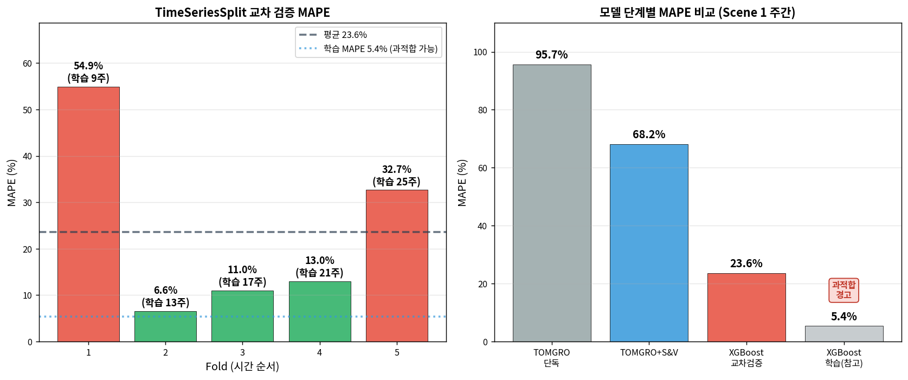
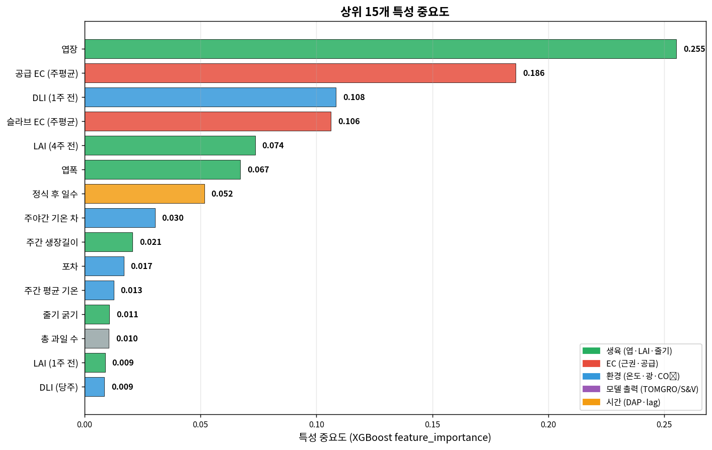
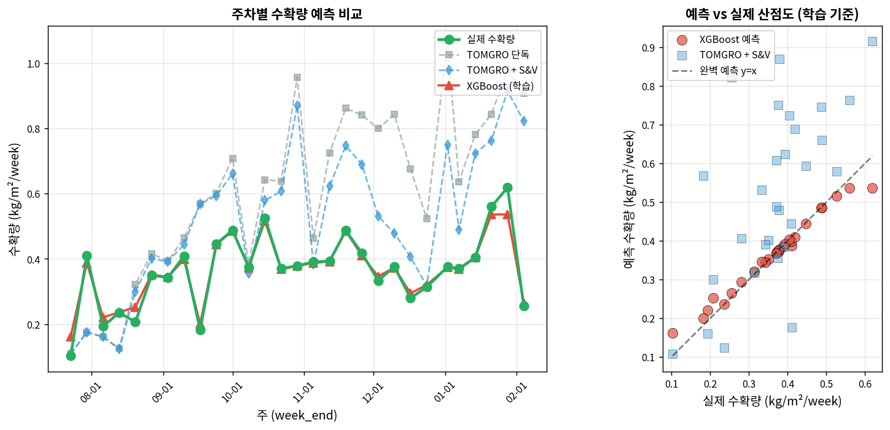

# XGBoost 모델 — 기술 상세 문서

**대상**: 재배 전문가 및 기술 검토자  
**기준 기간**: 2025-07-16 ~ 2026-02-04 (29주 학습 데이터)  
**작성 원칙**: 원본 CSV → 전처리 → 모델 학습 → 결과 → 과적합 분석까지 투명 공개

---

## 섹션 0 — XGBoost 도입 배경

### 0.1 왜 물리 모델만으로 부족한가

TOMGRO(물리 광합성)와 Sonneveld & Voogt(EC 수량 감소) 는 작물 생리학의 핵심 메커니즘을 수식화한 모델임. 하지만 본 작기 Scene 1 기준 MAPE는 다음과 같음:

| 모델 | MAPE | 해석 |
|---|---|---|
| TOMGRO 단독 | 95.7% | 건물 생산 상한만 계산 |
| TOMGRO + S&V | 68.2% | EC 손실 반영했지만 여전히 큼 |

두 물리 모델로도 **약 68%의 오차**가 남음. 남은 오차의 원인:
- 폐기과, 규격 미달 (Waste 데이터)
- 농작업 효과 (적과, 적엽, 적심 등 — 별도 문서 참조)
- 환경 변수 간 복잡한 상호작용
- 재배사 의사결정
- 품종 특성 미반영
- 화방별 발육 편차

**물리 수식으로 잡기 어려운 이러한 잔차 구조를 데이터로부터 학습하는 것이 XGBoost의 역할임.**

### 0.2 XGBoost란

XGBoost (eXtreme Gradient Boosting) 는 Chen & Guestrin (2016) 이 개발한 **결정 트리 기반 앙상블 학습 알고리즘**임. 다수의 얕은 결정 트리를 순차적으로 학습하며, 각 트리가 이전 트리의 예측 오차를 줄이는 방향으로 학습됨.

**기반 문헌**:
- Chen, T., Guestrin, C. (2016) "XGBoost: A Scalable Tree Boosting System" *Proceedings of the 22nd ACM SIGKDD International Conference on Knowledge Discovery and Data Mining*: 785-794
- Friedman, J.H. (2001) "Greedy function approximation: a gradient boosting machine" *Annals of Statistics* 29(5): 1189-1232

XGBoost를 선택한 이유:
- 표 형태 데이터(tabular) 에서 딥러닝보다 일반적으로 우수
- 특성 중요도 해석 가능
- 결측치 자동 처리
- 소규모 데이터(수십~수백 샘플)에서도 동작
- 농업 분야 연구에서 널리 사용됨

### 0.3 본 문서의 핵심 메시지 (먼저 명시)

XGBoost 결과를 다루기 전에, **이 모델의 근본적 한계를 명시함**:

- **학습 데이터가 매우 부족함**: 29주 (1작기 중 일부)
- **과적합 위험 높음**: 학습 MAPE 5.4% vs 교차검증 MAPE 23.6%
- **Fold별 편차 극심**: 6.6% ~ 54.9%
- **현재는 "파일럿" 수준**: 2~3작기 데이터 축적 후 본격 활용 예정

"XGBoost가 MAPE 5.4%로 예측함" 이라는 문구만 보면 훌륭해 보이지만, 이는 학습 데이터에 대한 성능임. **실제 검증 가능한 성능은 23.6%** 이며, 이 또한 Fold별로 크게 변동함.

**하지만 특성 중요도 (Feature Importance) 는 여전히 유용한 해석적 정보를 제공** 하며, 어떤 변수가 수확량에 영향 주는지 가설 수립에 쓸 수 있음.

---

## 섹션 1 — 입력 데이터와 전처리

### 1.1 데이터 소스

XGBoost는 **네 가지 소스**의 데이터를 통합:

| 소스 | 파일 | 용도 |
|---|---|---|
| PRIVA 환경 | `export.csv` (5분 단위) | 주간 집계 → 환경 특성 |
| 생육 측정 | `weekly_combined_with_LAI.csv` | 주간 생육 지표 |
| TOMGRO 결과 | `tomgro_all_weeks.csv` | 주간 물리 모델 출력 |
| 관수·수확 | `irrigation_main.csv` | EC, 실측 수확량 |

### 1.2 특성 설계 (36개)

주간 단위로 36개 특성 구성:

#### 환경 특성 (9개)
- `temp_mean`, `temp_day`, `temp_night`: 주간 기온 통계
- `DIF`: 주야간 기온 차 (식물 형태 영향)
- `CO2_day`: 주간 평균 CO₂
- `DLI`: 주간 평균 Daily Light Integral
- `VPD`: 주간 평균 포차 (증산 영향)
- `outside_temp`: 외기 기온

#### 생육 특성 (5개)
- `LAI`: 엽면적 지수
- `stem_thick`: 줄기 굵기
- `leaf_length`, `leaf_width`: 엽장, 엽폭
- `n_leaves`: 줄기당 엽수

#### 화방·과실 특성 (5개)
- `flowering`, `fruit_set`, `harvested_c`: 개화/착과/수확 화방 위치
- `total_fruits`: 현재 주당 총 과일 수
- `stem_growth`: 주간 생장 길이

#### EC 특성 (3개)
- `slab_ec_mean`, `slab_ec_max`: 슬라브 EC 주평균/주최대
- `supply_ec_mean`: 공급 EC 주평균

#### 물리 모델 출력 (4개)
- `tomgro_DM`: TOMGRO 총 건물
- `tomgro_fruit_DM`: TOMGRO 과실 건물
- `tomgro_fruit_FW`: TOMGRO 과실 신선무게 예측
- `tomgro_DLI`: TOMGRO 계산용 DLI

#### S&V 출력 (2개)
- `sv_relative_yield`: S&V 상대 수량
- `sv_loss_pct`: S&V 수량 손실 %

#### 시간 특성 (1개)
- `DAP`: 정식 후 경과일 (Days After Planting)

#### Lag 특성 (7개)
- `DLI_lag1`, `DLI_lag4`: 1주 전, 4주 전 DLI
- `tomgro_fruit_DM_lag1`, `tomgro_fruit_DM_lag4`: 1주/4주 전 TOMGRO 과실 건물
- `slab_ec_mean_lag1`, `slab_ec_mean_lag4`: 1주/4주 전 슬라브 EC
- `LAI_lag1`, `LAI_lag4`: 1주/4주 전 LAI

**왜 Lag 특성이 필요한가**: 방울토마토는 꽃이 피고 수확까지 약 8주가 소요됨. "이번 주의 환경 → 다음 주 수확" 이 아니라 "몇 주 전의 환경 → 이번 주 수확"의 시차 구조를 반영함.

### 1.3 타깃 변수 — 8주 시차 수확량

```python
LAG_WEEKS = 8
for week_end in features.index:
    target_week = week_end + pd.Timedelta(weeks=8)
    target = harvest.loc[target_week, 'harvest_kg_m2'].sum()
```

**의미**: W 주의 환경·생육 특성으로 **W+8 주의 실제 수확량을 예측**

**시차 근거**: 토마지노 품종의 개화~수확 약 8주 (TOMGRO 문서 섹션 5.2 와 동일)

### 1.4 데이터 정제

- 전체 주차: 39주 (2025-07-16 ~ 2026-04-08)
- TOMGRO·S&V·수확 모두 있는 주만 유지
- 수확량 0 인 주 제외 (수확 시작 전, 종료 후)
- **최종 학습 가능 주차: 29주**

---

## 섹션 2 — 모델 구조와 하이퍼파라미터

### 2.1 XGBoost 핵심 원리

XGBoost는 **트리 앙상블**을 순차적으로 구축함:

$$\hat{y}_i = \sum_{k=1}^{K} f_k(x_i), \quad f_k \in \mathcal{F}$$

**변수**:
- $\hat{y}_i$: i번째 샘플의 예측값
- $K$: 총 트리 수 (n_estimators)
- $f_k$: k번째 결정 트리
- $\mathcal{F}$: 가능한 트리 공간

각 트리는 이전 트리들의 **잔차**를 줄이는 방향으로 학습됨:

$$\mathcal{L}^{(t)} = \sum_{i=1}^{n} l(y_i, \hat{y}_i^{(t-1)} + f_t(x_i)) + \Omega(f_t)$$

**정규화 항** $\Omega(f_t)$ 가 트리 복잡도를 제한하여 과적합을 완화함:

$$\Omega(f) = \gamma T + \frac{1}{2} \lambda \sum_{j=1}^{T} w_j^2$$

- $T$: 리프 수, $w_j$: 리프 가중치
- $\gamma$: 리프 추가 페널티, $\lambda$: L2 정규화

### 2.2 사용한 하이퍼파라미터

**교차 검증 모델** (각 fold 학습):
```python
model = xgb.XGBRegressor(
    n_estimators=100,       # 트리 수
    learning_rate=0.05,      # 학습률
    max_depth=4,             # 트리 최대 깊이
    min_child_weight=2,      # 최소 리프 샘플 가중치
    reg_alpha=0.1,           # L1 정규화
    reg_lambda=1.0,          # L2 정규화
    random_state=42,
    verbosity=0
)
```

**최종 모델** (전체 29주 학습):
```python
final_model = xgb.XGBRegressor(
    n_estimators=200,        # 더 많은 트리
    learning_rate=0.03,      # 더 낮은 학습률
    max_depth=4,
    min_child_weight=2,
    reg_alpha=0.1,
    reg_lambda=1.0,
    random_state=42,
)
```

### 2.3 하이퍼파라미터 선택 근거

**`max_depth=4`**: 작은 값 (얕은 트리)
- 이유: 학습 데이터 29주로 매우 적음. 깊은 트리는 즉시 과적합
- 상식적 범위 3~6 중 중간값

**`min_child_weight=2`**: 보수적 분할
- 이유: 리프가 너무 작아지는 것 방지. 소규모 데이터에서 중요

**`learning_rate=0.05`** (CV) / **`0.03`** (최종)
- 이유: 낮은 학습률로 안정적 학습. 트리 수와 균형

**`reg_alpha=0.1, reg_lambda=1.0`**: 정규화 추가
- 이유: 특성 36개 vs 샘플 29개 → 특성이 더 많음. 정규화 필수

**근본 한계**: 이런 정규화에도 불구하고 **샘플 수가 근본적으로 부족함**. 하이퍼파라미터 튜닝으로 해결되지 않는 한계임.

---

## 섹션 3 — 교차 검증 전략

### 3.1 TimeSeriesSplit 사용

일반적인 K-Fold 교차 검증은 데이터를 무작위 분할함. 하지만 시계열 데이터에서는 **미래 데이터로 과거를 예측하는 오류**가 발생함.

**TimeSeriesSplit** 방식 (Varma & Simon, 2006):
```
Fold 1: 학습 [W1~W9]     | 검증 [W10~W13]
Fold 2: 학습 [W1~W13]    | 검증 [W14~W17]
Fold 3: 학습 [W1~W17]    | 검증 [W18~W21]
Fold 4: 학습 [W1~W21]    | 검증 [W22~W25]
Fold 5: 학습 [W1~W25]    | 검증 [W26~W29]
```

학습은 항상 **과거 데이터** 로만, 검증은 항상 **미래 데이터** 로. 현실적 예측 상황을 모사함.

### 3.2 Fold별 결과



| Fold | 학습 주 수 | 검증 주 수 | MAPE | MAE |
|---|---|---|---|---|
| 1 | 9 | 4 | **54.9%** | 0.255 |
| 2 | 13 | 4 | **6.6%** | 0.025 |
| 3 | 17 | 4 | 11.0% | 0.045 |
| 4 | 21 | 4 | 13.0% | 0.039 |
| 5 | 25 | 4 | **32.7%** | 0.145 |
| **평균** | | | **23.6% (±20.1)** | **0.102** |

**결과 해석**:

**Fold 1 (MAPE 54.9%) 극심한 실패**:
- 원인: 학습 9주는 정식 직후(2025-07~08) 초기 데이터만 포함
- 검증 4주는 9~10월 본격 수확기 포함
- 초기 생육과 수확기는 생리학적으로 완전히 다름
- 모델이 본 적 없는 패턴을 예측 시도

**Fold 2~4 (MAPE 6.6~13.0%) 괜찮음**:
- 학습에 어느 정도 다양한 시기 포함
- 검증 구간이 비슷한 생육 단계

**Fold 5 (MAPE 32.7%) 다시 악화**:
- 검증 구간이 2026-01~02 (한파, 겨울)
- 학습에 겨울 데이터가 적어 일반화 약함

**핵심 교훈**: **학습 데이터에 유사한 시기가 있어야 일반화 가능**. 1작기 데이터만으로는 "1년에 한 번 발생하는 패턴" 을 학습하기에 부족함.

### 3.3 학습/검증 MAPE 차이

```
학습 MAPE (29주 전체 학습 후 29주 예측): 5.4%  (R² = 0.958)
교차 검증 MAPE (과거로 학습, 미래 예측): 23.6%
차이: 18.2 포인트
```

**이는 전형적 과적합 징후임.**

모델이 학습 데이터에서는 거의 완벽히 맞히지만, 못 본 데이터에서는 4배 이상의 오차 발생. 앞서 강조한 대로 **현재 XGBoost는 파일럿 수준** 임.

---

## 섹션 4 — 특성 중요도 분석

### 4.1 상위 15개 특성



| 순위 | 특성 | 중요도 | 카테고리 |
|---|---|---|---|
| 1 | 엽장 (leaf_length) | 0.255 | 생육 |
| 2 | 공급 EC (주평균) | 0.186 | EC |
| 3 | DLI (1주 전) | 0.108 | 환경 (시차) |
| 4 | 슬라브 EC (주평균) | 0.106 | EC |
| 5 | LAI (4주 전) | 0.074 | 생육 (시차) |
| 6 | 엽폭 | 0.067 | 생육 |
| 7 | 정식 후 일수 | 0.052 | 시간 |
| 8 | 주야간 기온 차 (DIF) | 0.030 | 환경 |
| 9 | 주간 생장 길이 | 0.021 | 생육 |
| 10 | 포차 (VPD) | 0.017 | 환경 |
| 11 | 주간 평균 기온 | 0.013 | 환경 |
| 12 | 줄기 굵기 | 0.011 | 생육 |
| 13 | 총 과일 수 | 0.010 | 화방 |
| 14 | LAI (1주 전) | 0.009 | 생육 (시차) |
| 15 | DLI (당주) | 0.009 | 환경 |

### 4.2 해석

**특성 중요도는 신뢰할 수 있는가**:

과적합이 강해도 **특성 중요도는 상대적 정보** 이므로, 샘플 수가 적더라도 **어떤 변수가 수확량과 관련 있는지** 를 보여줌. 다만 구체 수치보다 **순위** 에 의미 부여가 적절함.

**주요 발견**:

#### (1) 엽장이 가장 중요 (25.5%)

예상 밖 결과. 일반적으로 LAI 나 환경 변수가 상위일 것 같지만, 개별 엽장 측정값이 최상위.

**가능한 설명**:
- 엽장은 작물 세력의 직접 지표
- 주당 측정값이라 변동 크고, 수확량 차이를 잘 분리
- LAI 는 계산값이라 원시 데이터보다 변동 흐릿

#### (2) EC 가 상위 (공급 18.6%, 슬라브 10.6%)

**S&V 문서의 발견을 XGBoost도 독립적으로 확인**:
- 공급 EC 와 슬라브 EC 모두 상위 10위 이내
- S&V 가 가정한 "EC → 수량 감소" 관계가 데이터로 재확인

#### (3) 1주 전 DLI 의 높은 중요도 (10.8%)

- 당주 DLI (0.009) 보다 훨씬 중요
- 일주일 전 일사량이 이번 주 수확에 영향
- Lag 특성 설계가 적절함을 확인

#### (4) 4주 전 LAI 의 중요도 (7.4%)

- 당주 LAI (미포함) 보다 4주 전 LAI 가 예측에 기여
- 4주 전 엽면적이 지금의 과실 발육과 연관
- 토마토 과실 발육 주기 (약 4~5주)와 일치

#### (5) TOMGRO/S&V 출력이 상위 15개에 **없음**

**중요한 관찰**: `tomgro_fruit_FW`, `sv_relative_yield` 등 물리 모델 출력이 상위 특성에 없음.

**가능한 설명**:
- 학습 데이터가 너무 적어 물리 모델 출력과 다른 생육 변수 간 구분을 못함
- 엽장·EC·DLI 등 더 원시적 특성에 XGBoost가 과적합
- 2~3작기 데이터 확보 후 재평가 필요

**이는 XGBoost가 물리 모델을 대체한다는 의미가 아님**. 오히려 **학습 데이터 부족으로 XGBoost가 신뢰할 만한 예측을 못 함** 을 보여줌.

---

## 섹션 5 — 예측 결과

### 5.1 시계열 예측



**왼쪽 (시계열)**:
- 실제 수확량 (녹색): 0.103 ~ 0.619 kg/m²/week 변동
- TOMGRO 단독 (회색): 지속적 과대 예측
- TOMGRO + S&V (파란): 과대 예측 축소, 여전히 차이 큼
- XGBoost 학습 예측 (빨강): 실제선에 거의 겹침 — **과적합**

**오른쪽 (산점도)**:
- XGBoost 학습 예측: y=x 선에 딱 붙어 있음 (과적합)
- TOMGRO + S&V: 전반적으로 과대, 넓게 분산

### 5.2 주의 — 이 그래프의 올바른 해석

XGBoost 예측선이 실제와 겹친 것은 "**모델이 정확하다**"가 아니라 "**학습 데이터를 외운 결과**" 에 가까움.

**진정한 성능은 교차 검증 MAPE 23.6%** (섹션 3 참조). Fold 1 에서는 54.9% 까지 나옴. 이 XGBoost 를 다른 작기, 다른 농장에 적용하면 성능 급락 가능성 매우 높음.

---

## 섹션 6 — 파라미터 전체 목록과 조정 이력

### 6.1 모델 하이퍼파라미터

| 파라미터 | 값 | 이유 |
|---|---|---|
| n_estimators (CV) | 100 | 보수적, 과적합 완화 |
| n_estimators (최종) | 200 | 전체 학습 시 조금 증가 |
| learning_rate (CV) | 0.05 | 안정적 학습 |
| learning_rate (최종) | 0.03 | 더 낮춰 일반화 기대 |
| max_depth | 4 | 얕은 트리로 과적합 완화 |
| min_child_weight | 2 | 소규모 샘플 보호 |
| reg_alpha (L1) | 0.1 | 특성 선택 효과 |
| reg_lambda (L2) | 1.0 | 가중치 정규화 |
| random_state | 42 | 재현성 |

### 6.2 데이터 설계 선택

| 결정 | 값 | 근거 |
|---|---|---|
| LAG_WEEKS | 8 | 토마지노 개화~수확 기간 |
| 주간 집계 방식 | 평균 + 최대 혼용 | 변동성 반영 |
| 특성 수 | 36 | 가용한 모든 변수 포함 |
| 샘플 필터 | 수확량 > 0 | 수확기 외 제외 |
| CV 방식 | TimeSeriesSplit 5-fold | 시간 순서 유지 |
| 결측 처리 | XGBoost native NaN | 추가 전처리 생략 |

### 6.3 조정하지 않은 것 (투명성)

**하이퍼파라미터 튜닝 안 함**:
- GridSearch, RandomSearch, Bayesian Optimization 등 사용 안 함 (Bergstra & Bengio, 2012)
- 이유: 29주 샘플로는 튜닝 과정에서 또 과적합 위험 (Hastie et al., 2009)
- 기본값에 가까운 보수적 설정만 사용

**특성 선택 안 함**:
- 36개 특성 모두 사용, 일부 제거 안 함
- XGBoost 자체 L1 정규화로 불필요한 특성은 자동 가중치 낮아짐
- 사후 수동 선택은 검증 데이터에 영향 주므로 피함

---

## 섹션 7 — 한계와 다음 단계

### 7.1 근본 한계

#### (1) 데이터 부족

- 29주 학습 샘플
- 딥러닝/복잡한 ML은 일반적으로 수백~수천 샘플 요구
- XGBoost 도 최소 100샘플 이상 권장
- **현재는 "파일럿" 수준**

#### (2) 계절 대표성 부족

- 1작기 데이터만 보유
- 여름(고온·고광)과 겨울(저온·저광) 각 1번만 관찰
- 특히 Fold 1 (학습 9주) 에서 드러남
- **"연도별 변동" 을 학습할 데이터 없음**

#### (3) 품종·농장 특이성

- 토마지노 품종, 본 농장 한 곳 데이터만
- 다른 방울토마토 품종, 다른 농장에 일반화 불가
- 전이 학습 (Transfer Learning) 필요

#### (4) 농작업 효과 분리 불가

- 적과, 적엽, 적심 등 작업 기록 없음
- XGBoost 잔차 중 농작업 기여분 분리 불가
- FarmWork 시스템 데이터 축적 후 재학습 필요 (별도_농작업 문서 참조)

### 7.2 신뢰할 수 있는 것과 없는 것

| 구분 | 신뢰 가능 | 신뢰 불가 |
|---|---|---|
| 학습 MAPE 5.4% | ❌ 과적합 지표 | |
| 교차검증 MAPE 23.6% | ⚠️ 참고 수준 | 근본 성능 지표 |
| Fold별 편차 6.6~54.9% | ✅ 데이터 부족 경고 | |
| 특성 중요도 순위 | ✅ 해석적 가설 | 구체 수치 |
| 예측값 (산점도) | ❌ 과적합된 fit | |

### 7.3 단계별 개선 로드맵

#### Phase 1: 현재 (1작기 완료 시점)

- ✅ 파일럿 모델 구축
- ✅ 특성 중요도 파악 → 재배 관리 가설 수립
- ✅ 과적합 진단 및 투명 공개
- ❌ 실무 예측 의사결정에 직접 사용 금지

#### Phase 2: 2작기 종료 후 (데이터 2배)

- 샘플 약 60주로 증가
- 계절 데이터 2회 확보
- 교차 검증 MAPE 안정화 기대
- 하이퍼파라미터 튜닝 가능

#### Phase 3: 3~5작기 누적 후

- 샘플 150~250주
- 계절, 연도, 한파/폭염 등 특수 조건 포함
- FarmWork 농작업 데이터 통합
- **실무 예측에 사용 가능 수준**

### 7.4 통합 검증 섹션 예고

다음 문서 (06_통합검증) 에서 다룰 내용:
- TOMGRO + S&V + XGBoost 전체 체인
- 시나리오별 MAPE 비교
- 남은 잔차 분석
- DeePC (최적 제어) 입력 준비

---

## 섹션 8 — 참고 문헌

1. Chen, T., Guestrin, C. (2016). "XGBoost: A Scalable Tree Boosting System." *Proceedings of the 22nd ACM SIGKDD International Conference on Knowledge Discovery and Data Mining*: 785-794.

2. Friedman, J.H. (2001). "Greedy function approximation: a gradient boosting machine." *Annals of Statistics* 29(5): 1189-1232.

3. Hastie, T., Tibshirani, R., Friedman, J. (2009). *The Elements of Statistical Learning: Data Mining, Inference, and Prediction* (2nd ed.). Springer.

4. Bergstra, J., Bengio, Y. (2012). "Random search for hyper-parameter optimization." *Journal of Machine Learning Research* 13: 281-305.

5. Varma, S., Simon, R. (2006). "Bias in error estimation when using cross-validation for model selection." *BMC Bioinformatics* 7(1): 91.

---

## 부록 — 이 섹션 작성에 참조한 이미지 파일

같은 폴더 내 이미지:
- `xgb_fold_mape.png` — 섹션 3.2 (Fold별 MAPE와 모델 단계별 비교)
- `xgb_feature_importance.png` — 섹션 4.1 (상위 15개 특성 중요도)
- `xgb_pred_vs_actual.png` — 섹션 5.1 (예측 vs 실제)

---

*작성: 2026-04-19 / 29주 학습 데이터 기반 (2025-07-16 ~ 2026-02-04)*  
*모든 수치는 `build_xgboost.py` 실제 실행 결과 그대로*
