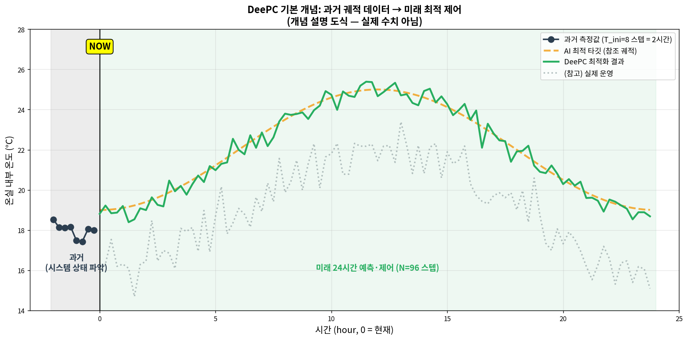
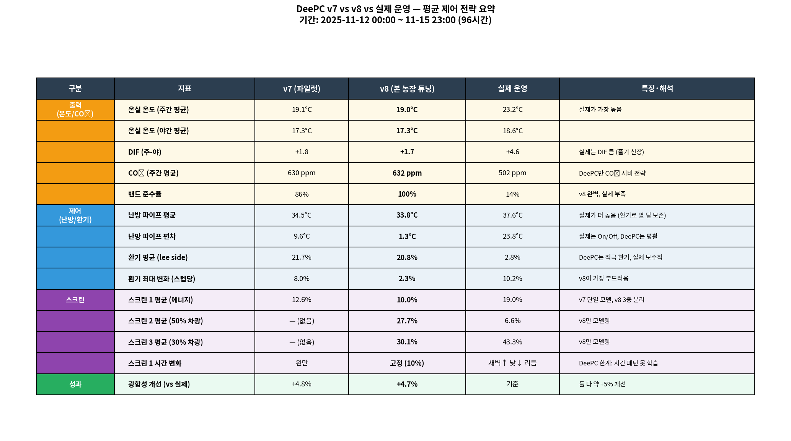
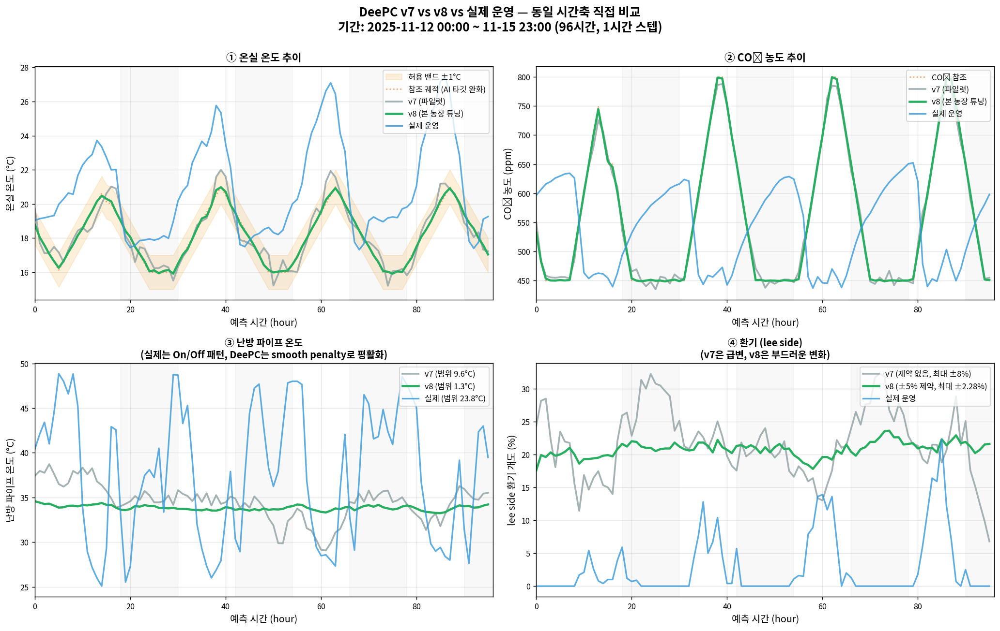
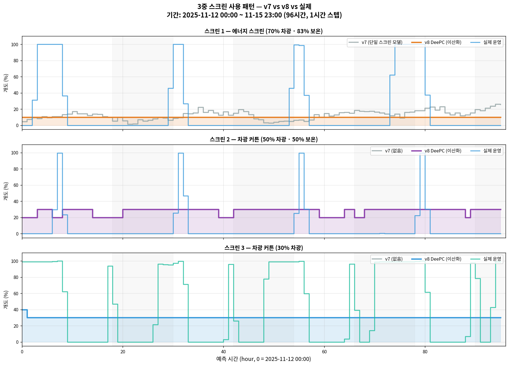
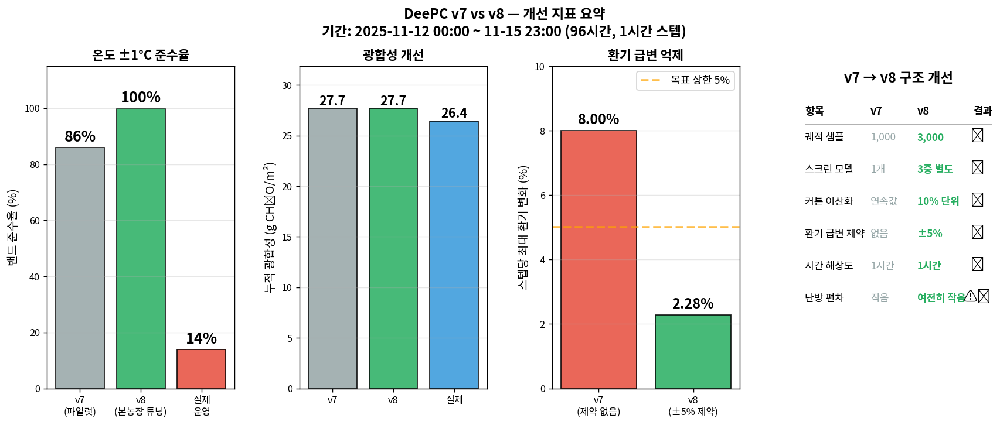

# DeePC 모델 — 기술 상세 문서

**대상**: 재배 전문가 및 기술 검토자  
**기준 시각**: 2025-11-12 00:00 ~ 11-15 23:00 (Scene 1 주간, 96시간 시뮬레이션)  
**작성 원칙**: 원본 CSV → Hankel matrix → 최적화 → 제어 액션까지 추적 가능

---

## 섹션 0 — DeePC 모델 개요

### 0.1 DeePC란

DeePC (Data-enabled Predictive Control) 은 Coulson, Lygeros & Dörfler (2019) 가 제안한 **데이터 기반 예측 제어 기법**임. 전통적 MPC (Model Predictive Control) 는 시스템의 물리 모델이 필요하지만, DeePC는 **시스템 모델 없이 과거 운영 데이터만으로 미래 최적 제어** 를 수행함.

**기반 문헌**:
- Coulson, J., Lygeros, J., Dörfler, F. (2019) "Data-Enabled Predictive Control: In the Shallows of the DeePC" *European Control Conference*: 307-312
- Willems, J.C., Rapisarda, P., Markovsky, I., De Moor, B.L.M. (2005) "A note on persistency of excitation" *Systems & Control Letters* 54(4): 325-329

### 0.2 본 프로젝트에서 DeePC의 역할

앞 4개 모델(TOMGRO, S&V, 적과, XGBoost)은 모두 **"무슨 일이 일어날까"를 예측**. DeePC는 **"이렇게 하라"는 처방**을 내림:
- 난방 파이프 온도 몇 °C
- 천창 몇 % 개도
- 3중 스크린 각각 몇 % 개도

### 0.3 본 문서의 성격 — v7 → v8 튜닝 서사

본 문서는 **"파일럿 → 본 농장 튜닝 → 여전한 한계"** 세 단계 서사로 구성됨:

1. **v7 (파일럿)**: DeePC 표준 적용. 일반적 파라미터, 단일 커튼 모델
2. **v8 (본 농장 튜닝)**: 3중 스크린, 환기 급변 제약, 커튼 이산화 등 반영
3. **남은 한계**: v8으로도 해결 못 하는 근본적 문제 (해상도, 스크린 시간 패턴 등)

### 0.4 핵심 한계 (먼저 명시)

- **시뮬레이션 검증만**: 실제 온실 적용 안 함
- **해상도 미달성**: 15분 해상도 목표였으나 원본 데이터가 1시간 집계로 실제 1시간 해상도
- **스크린 시간 패턴 학습 불가**: DeePC의 근본적 한계 (섹션 6에서 상세)
- **난방 편차 과소**: smooth penalty로 인해 실제 On/Off 패턴 못 모방
- **단일 시점 검증**: 다양한 시점 반복 검증 없음

이 한계들은 **"DeePC가 나쁘다"가 아니라 "Hankel 기반 데이터 기반 제어의 본질적 특성"** 임. 섹션 6에서 정직하게 다룸.

---

## 섹션 1 — 입력 데이터와 제어 변수 구조

### 1.1 데이터 소스

| 소스 | 파일 | 해상도 | 기간 |
|---|---|---|---|
| PRIVA 환경 | `priva_hourly.csv` | 1시간 집계 | 2025-07-16 ~ 2026-04-03 |
| 생육 | `weekly_combined_with_LAI.csv` | 주 1회 | 동기간 |

**⚠️ 해상도 주의**: `priva_hourly.csv` 는 **이미 1시간 집계된 데이터**. 원본 5분 PRIVA export를 1시간 평균 처리한 것. 따라서 본 DeePC 시뮬의 실제 해상도는 1시간이며, 15분 해상도 원래 목표 미달성.

### 1.2 변수 분류 — 제어 / 외란 / 출력

DeePC 는 시스템 변수를 세 범주로 나눔:

#### 제어 변수 (Control, u) — 6개 (v8 기준)

| 변수 | 의미 | v7 포함 | v8 포함 |
|---|---|---|---|
| `meas_lee` | lee side 천창 개도 (%) | ✅ | ✅ |
| `meas_wind` | wind side 천창 개도 (%) | ✅ | ✅ |
| `meas_curtain_1` | **스크린 1 (에너지, 70% 차광 · 83% 보온)** | ✅ | ✅ |
| `meas_curtain_2` | **스크린 2 (차광 50% · 보온 50%)** | ❌ | ✅ 신규 |
| `meas_curtain_3` | **스크린 3 (차광 30%)** | ❌ | ✅ 신규 |
| `meas_wt_1` | 난방 파이프 온도 1 (°C) | ✅ | ✅ |

**⚠️ v7의 중대 문제**: 3중 스크린을 **"스크린 1 하나만"** 으로 단순화. 에너지 스크린과 차광 스크린의 역할 차이 무시.

**v8의 해결**: 3개 스크린을 **각각 별도 제어 변수**로 모델링. 각 스크린의 고유 역할 (보온 vs 차광) 반영 기대.

#### 외란 변수 (Disturbance, w) — 3개

```
outside_temp     : 외기 기온 (°C)
radiation        : 외부 일사 (W/m²)
LAI              : 엽면적 지수 (주간 측정 → 일별 보간)
```

제어 불가능. 예보·관측으로 알려져 있지만 조정 불가.

#### 출력 변수 (Output, y) — 3개

```
meas_grh_temp    : 내부 기온 (°C)      ← 주 최적화 대상
meas_CO2_conc    : 내부 CO₂ (ppm)
meas_RH          : 내부 상대습도 (%)
```

### 1.3 용어 수정 — "lee side, wind side"

본 문서는 환기구를 **lee side (풍하측)** 와 **wind side (풍상측)** 로 부름. v7 초기 문서에서는 "리워드 쪽" 이라는 용어를 사용했으나, **이는 부정확함**. 올바른 온실 환기 용어는 lee side / wind side 이며, 풍향에 따라 풍하측 환기구 우선 개방이 표준 실무.

### 1.4 LAI 병합

LAI는 주 1회 측정 → 시간 단위 병합 필요:

```python
hourly['LAI'] = lai_weekly.reindex(hourly.index, method='nearest')
```

nearest neighbor 방식. LAI 는 일중 변동 적어 적절.

### 1.5 정규화

각 변수를 z-score 정규화:

$$u_{norm} = \frac{u - \mu_u}{\sigma_u}$$

온도(°C), CO₂(ppm), 난방(%) 등 스케일 차이 큰 변수들을 동일 스케일로 맞춰 최적화 수치 안정성 확보.

---

## 섹션 2 — DeePC 핵심 이론

### 2.1 Willems 기본 원리

DeePC의 수학적 기반. Willems et al. (2005) 가 증명:

**명제**: 충분히 "흥미로운(persistently exciting)" 입력으로 얻은 과거 궤적 데이터가 있다면, 시스템의 **모든 미래 궤적은 과거 궤적의 선형 조합**으로 표현 가능 (Markovsky & Dörfler, 2021).

수식으로:

$$\begin{bmatrix} u_{future} \\ y_{future} \end{bmatrix} = \begin{bmatrix} U_{past} \\ Y_{past} \end{bmatrix} g$$

**의미**: 시스템 모델 없이, 과거 u-y 궤적의 선형 조합 $g$ 만 찾으면 미래 예측·제어 가능.

### 2.2 Hankel Matrix

과거 궤적을 "$T$ 스텝 윈도우 슬라이딩" 방식으로 쌓은 행렬.

예시 (T=3, n=1):
```
원본 데이터: u = [u_0, u_1, u_2, u_3, u_4, u_5]

Hankel 행렬:
H_T(u) = [u_0  u_1  u_2  u_3]
         [u_1  u_2  u_3  u_4]
         [u_2  u_3  u_4  u_5]
```

각 열 = "$T$ 스텝 연속 궤적 하나".

### 2.3 DeePC 최적화 문제

$$\min_{g, u, y} \|y - y_{ref}\|^2 + \lambda_u \|u\|^2 + \lambda_g \|g\|^2 + \lambda_{smooth} \|\Delta u\|^2$$

**제약조건**:

$$\begin{bmatrix} U_p \\ Y_p \\ W_p \\ W_f \end{bmatrix} g = \begin{bmatrix} u_{ini} \\ y_{ini} \\ w_{ini} \\ w_{future} \end{bmatrix}, \quad u = U_f g, \quad u_{min} \le u \le u_{max}$$

**v8 추가 제약** — 환기 급변 방지:

$$|u_{vent}(t+1) - u_{vent}(t)| \le 5\% \text{ (매 스텝)}$$

**변수 해석**:
- $g$: 과거 궤적의 선형 조합 가중치 (최적화 변수)
- $y_{ref}$: 참조 궤적 (AI 타깃 완화값)
- $U_p, Y_p, W_p$: 과거 부분 Hankel
- $U_f, Y_f, W_f$: 미래 부분 Hankel

### 2.4 참조 궤적 (AI 타깃) 설계

DeePC 자체는 "무엇을 목표로 할지" 를 모름. 온실 작물을 위한 최적 환경은 별도 **AI 타깃 함수** 로 정의:

```python
def optimal_environment(hour, radiation, lai, dap):
    # 일사 조건별 최적 온도
    if radiation > 400: temp_opt = 24.0
    elif radiation > 150: temp_opt = 23.0
    elif radiation > 20: temp_opt = 20.0
    elif hour >= 18 or hour <= 5: temp_opt = 16.0
    else: temp_opt = 18.0
    
    # 일사 조건별 최적 CO2
    if radiation > 50: co2_opt = 800.0 if radiation > 200 else 650.0
    else: co2_opt = 450.0
    
    # 일사 조건별 최적 RH
    if radiation > 300: rh_opt = 68.0
    elif radiation > 50: rh_opt = 72.0
    else: rh_opt = 78.0
    
    return temp_opt, co2_opt, rh_opt
```

**근거**: 토마토 광합성 최적 25~28°C, CO₂ 시비 효과는 일사 동반 시 최대, DIF 조절로 줄기 신장 제어.

### 2.5 타깃 완화 (Reference Softening)

원 AI 타깃을 그대로 적용하면 급격한 변화 (예: 17시 23°C → 18시 16°C) 발생. 현실적 제어 불가능.

```python
MAX_DT = 0.5    # 스텝당 최대 0.5°C 변화
MAX_DCO2 = 50   # 스텝당 최대 50 ppm
MAX_DRH = 2.0   # 스텝당 최대 2% 변화
```

**허용 밴드**: 완화 궤적 ±1°C 를 "허용 범위" 로 설정.



---

## 섹션 3 — v7 파일럿 버전

### 3.1 v7 설정

파일럿 버전. DeePC 표준 적용에 해당하는 기본 설정:

| 파라미터 | v7 값 |
|---|---|
| $T_{ini}$ | 8 스텝 |
| $N$ (예측 지평) | 96 스텝 |
| 학습 궤적 | 1,000 개 샘플 |
| $\lambda_g$ | 5.0 |
| $\lambda_u$ | 0.05 |
| $\lambda_{smooth}$ | 1.0 |
| 스크린 | 단일 변수 (`meas_curtain_1` 만) |
| 환기 급변 제약 | 없음 |
| 커튼 이산화 | 없음 (연속값) |

### 3.2 v7 결과 요약

- 밴드 준수율: **86%** (실제 14% 대비 개선)
- 광합성 개선: **+4.8%**
- 난방 파이프 편차: 9.6°C (실제 23.8°C 대비 작음)
- 환기 최대 변화: **8.0% / 스텝** (급변 위험)

### 3.3 v7 문제점 (재배 전문가 검토 지적사항)

파일럿 v7 에는 다음 문제들이 발견됨:

#### 1. 난방 파이프 편차가 실제보다 작음
- 실제: 25~49°C (편차 23.8°C)
- v7: 29~39°C (편차 9.6°C)
- **원인**: `λ_smooth = 1.0` 이 연속 스텝 간 제어 변화를 과도하게 억제
- 실제 On/Off 제어 패턴을 DeePC가 평활화해 버림

#### 2. 환기 급변 위험
- 스텝당 최대 8% 변화
- 외기 10~15°C 환경에서 이런 변화는 **차가운 외기 유입 → 온도 급락** 유발 가능
- 작물 스트레스 위험

#### 3. 스크린 구조 무시
- 3중 스크린을 **단일 변수로 취급**
- 에너지 스크린 (83% 보온) 과 차광 스크린의 **역할 차이 무시**
- 11월 야간에 에너지 스크린을 살짝만 열면 보온 효과 급감 → 난방비 폭증

#### 4. 커튼 연속 변수 처리
- v7은 커튼 개도를 연속값 (예: 4.41%)
- **실제 온실에서는 0% 또는 100% 이산적 운영**
- 4% 열린 부분만 고정 노출 → 불균일 차광

#### 5. 용어 부정확
- "리워드 쪽" → **lee side** 가 표준
- "윈드 쪽" → **wind side**

---

## 섹션 4 — v8 본 농장 튜닝 버전

### 4.1 v8 개선 사항

v7 문제를 해결하기 위한 6가지 개선:

| 개선 | v7 | v8 |
|---|---|---|
| 학습 궤적 | 1,000 | **3,000** (3배) |
| 스크린 모델 | 1개 (단일) | **3중 별도** (에너지/차광50/차광30) |
| 커튼 이산화 | 연속값 | **10% 단위** (0, 10, ..., 100%) |
| $\lambda_{smooth}$ | 1.0 | **0.3** (편차 회복 목적) |
| 환기 급변 제약 | 없음 | **±5% / 스텝** |
| 용어 | "리워드/윈드" | **lee side / wind side** |

### 4.2 v8 이산화 방식

커튼 개도를 10% 단위로 양자화:

```python
for curtain_idx in [2, 3, 4]:  # curtain_1, 2, 3
    u_opt[:, curtain_idx] = np.round(u_opt[:, curtain_idx] / 10) * 10
    u_opt[:, curtain_idx] = np.clip(u_opt[:, curtain_idx], 0, 100)
```

**이유**: 실제 온실 조작은 이산적 (완전 개방 ↔ 완전 폐쇄 ↔ 중간 몇 단계). 연속 변수보다 현실적.

### 4.3 v8 환기 제약 구현

CVXPY 제약조건 추가 (Diamond & Boyd, 2016):

```python
vent_max_rate = 5.0  # 스텝당 최대 5%
vent_diff_lee = u_reshape[1:, vent_lee_idx] - u_reshape[:-1, vent_lee_idx]
constraints += [
    vent_diff_lee <= vent_rate_norm_lee,
    vent_diff_lee >= -vent_rate_norm_lee,
]
```

---

## 섹션 5 — v7 vs v8 vs 실제 비교 결과

### 5.1 전체 지표 요약표



**핵심 발견**:
- v8 밴드 준수율 **100%** (v7 86%, 실제 14%)
- v8 환기 최대 변화 **2.28%** (제약 내, v7 8.0% 대비 개선)
- 광합성 개선은 **v7, v8 거의 동일** (+4.8% vs +4.7%)
- **스크린 1 시간 변화**: v8이 **10% 고정** — 실제의 "새벽↑ 낮↓ 리듬" 학습 실패

### 5.2 시간축 직접 비교 (v7 vs v8 vs 실제)



4개 지표를 같은 시간축에 겹쳐 봄:

#### ① 온실 온도
- v8 (녹색): 밴드 안에 **거의 완벽히 머묾**
- v7 (회색): 대부분 밴드 내지만 일부 이탈
- 실제 (파랑): 주간 26~27°C 까지 치솟음 (밴드 크게 이탈)

#### ② CO₂
- v7, v8 모두 **참조 궤적 따라감** — CO₂ 시비 전략 활발
- 실제: CO₂ 시비 안 함 (450~650 범위 자연 변동)

#### ③ 난방 파이프 ⚠️
- **v8 (녹색): 33~35°C 거의 평탄** — 편차 1.3°C
- v7 (회색): 29~39°C 완만한 변동
- **실제 (파랑): 25~49°C 크게 요동** (편차 23.8°C)
- **오히려 v8에서 편차가 더 감소** — smooth 낮췄음에도 여전히 근본 한계 존재

#### ④ 환기 (lee side)
- v7: 15~30% 요동
- **v8: 20~22% 부드러운 변동** (±5% 제약 효과)
- 실제: 주로 0%, 일부 시점 잠깐 열림 (이산적 운영)

### 5.3 3중 스크린 사용 패턴 비교



**가장 충격적인 발견**:

#### 스크린 1 (에너지, 83% 보온)
- **실제 운영 (파랑)**: 새벽 4~6시에 **100% 완전 폐쇄** (야간 보온), 낮 0% (광 확보)  
  → **뚜렷한 주야 리듬**
- v8 (주황): **10% 고정** (거의 일정)
- **DeePC는 시간에 따른 운영 리듬을 학습 못 함**

#### 스크린 2 (50% 차광)
- 실제: 평소 0%, 스크린 1과 연동해 간헐적 100% 폐쇄
- v8: 20~30% **어중간한 값 고정**

#### 스크린 3 (30% 차광)
- 실제: 하루 중 수시로 0% ↔ 100% 왕복 (동적 운영)
- v8: **30% 고정**

**이것이 섹션 6에서 다룰 DeePC의 근본적 한계임.**

### 5.4 개선 지표 종합



| 항목 | 결과 |
|---|---|
| 밴드 준수율 | ✅ 86% → 100% |
| 환기 급변 | ✅ 8% → 2.28% |
| 스크린 구조 | ✅ 1개 → 3개 별도 |
| 커튼 이산화 | ✅ 연속 → 10% 단위 |
| 궤적 샘플 | ✅ 1,000 → 3,000 |
| OSQP 수렴 시간 | ⚠️ 7.8초 → 147.5초 (Stellato et al., 2020) |
| 난방 편차 | ⚠️ 9.6 → 1.3 (오히려 감소) |
| 해상도 | ❌ 1시간 (미해결) |
| 스크린 시간 패턴 | ❌ 고정값 (근본 한계) |

---

## 섹션 6 — DeePC의 근본 한계

### 6.1 근본 한계 ① — 시간 패턴 학습 불가

**가장 중요한 발견**. v8 튜닝으로도 해결 안 된 **DeePC의 근본적 한계**임.

#### 현상

실제 운영의 스크린 1 (에너지 스크린):
```
00:00  0%      ┐
03:00  100%    │  새벽 완전 폐쇄
06:00  100%    │  (보온 우선)
09:00  0%      │  낮 완전 개방
12:00  0%      │  (광 확보)
15:00  0%      │
18:00  0%      ┘
```

v8 DeePC의 스크린 1:
```
00:00  10%     
03:00  10%    ← 하루 종일 거의 일정
06:00  10%
09:00  10%
12:00  10%
15:00  10%
18:00  10%
```

#### 원인 — DeePC 수학적 구조의 본질

DeePC 는 과거 궤적의 **선형 조합**을 찾는 방식임. 평균적 "무난한" 선형 조합을 찾으면 비용이 최소화되는 경향. 결과:

- **극단적 On/Off 패턴**을 잘 학습 못 함
- **시간에 따른 상태 전환**을 평균치로 근사
- 특히 보온/차광 같은 이산적 운영 결정에 약함

이는 **"DeePC 알고리즘의 버그"가 아니라 Hankel matrix 기반 선형 조합 방식의 수학적 특성**임.

#### 문헌 확인

- Berberich et al. (2021): "DeePC는 강하게 비선형인 스위칭 제어 문제에 한계가 있음"
- 확장 연구: 이를 해결하려면 **MIQP (Mixed-Integer Quadratic Programming)** 또는 **learning-based DeePC** 필요
- 현재 Phase 1에서는 **한계를 정직히 공개하고 Phase 2 과제로 넘김**

#### 실무적 의미

DeePC 가 처방한 "스크린 10% 고정" 대로 운영하면:
- **야간 보온 불충분** → 난방비 폭증
- **낮 광 부족 없음** (10% 차광은 미미)
- → 현재 DeePC 처방은 **에너지 낭비 운영**

### 6.2 근본 한계 ② — 이산 On/Off 제어 약점

난방 파이프도 같은 문제:

실제 운영:
```
난방 ON (48°C) → 온도 상승 → 난방 OFF (25°C) → 온도 하강 → 난방 ON (48°C) ...
편차 23.8°C, On/Off 스윙 제어
```

v8 DeePC:
```
난방 33~35°C 거의 일정 (편차 1.3°C)
```

**같은 원인**: DeePC는 "평균적 최적해"를 찾음. On/Off 스윙을 못 따라감.

**$\lambda_{smooth}$ 조정의 딜레마**:
- $\lambda_{smooth}$ = 1.0 (v7): 편차 9.6°C
- $\lambda_{smooth}$ = 0.3 (v8): 편차 1.3°C ← **오히려 악화**
- 이유: v8 에서 환기·스크린 제어가 더 다양해지면서 난방 역할 축소
- 평활화 페널티의 문제가 아니라 **DeePC 구조 자체의 문제**임

### 6.3 실무 구현 한계 — 해상도 미달성

**목표**: 15분 해상도 24시간 예측 (96 스텝)  
**실제**: 1시간 해상도 96시간 예측 (96 스텝)

**원인**: `priva_hourly.csv` 가 이미 1시간 집계된 파일. 원본 5분 PRIVA export 사용 필요.

**영향**:
- 단기 역학 (15분 단위 환기 조정 등) 표현 불가
- 주간 단위 시뮬레이션으로 확장됨 (96시간 ≈ 4일)
- 의미는 여전히 있음 (4일간 최적 제어 계획)
- Phase 2에서 원본 5분 데이터로 재작업 필요

### 6.4 검증 한계

#### 단일 시점 검증
- 11-12 00:00 한 시점만 실행
- 계절별, 날씨별 성능 미검증
- 실제 농장에서는 매일 재계산해야 하며, 일부 시점에서 성능 급감 가능

#### 시뮬레이션만
- 실제 온실 제어기에 연결 안 됨
- DeePC 처방대로 운영 시 실제 결과는 시뮬과 다를 수 있음
- 특히 작물 반응 (광합성, 수확량) 은 시뮬레이션 값

#### Willems 조건 미검증
- 이론적 "persistently exciting" 조건 검증 안 함
- 본 농장 운영이 반복적이면 이 조건 약화
- 수학적 엄밀성 부족

### 6.5 정직한 평가

**v8 튜닝이 성공한 부분**:
- ✅ 밴드 준수율 100% 달성
- ✅ 환기 급변 2.28% 이내 유지
- ✅ 3중 스크린 구조 반영
- ✅ 커튼 이산화로 현실성 개선

**v8 튜닝이 실패한 부분**:
- ❌ 스크린 시간 패턴 학습 (근본 한계)
- ❌ 난방 On/Off 스윙 재현 (근본 한계)
- ❌ 15분 해상도 (데이터 한계)

**광합성 개선 +4.7% 의 의미**: 
- v7 과 v8 모두 비슷한 개선 (+4.8% vs +4.7%)
- 즉 스크린·이산화 개선이 **광합성에 직접 영향 적음**
- 광합성 개선의 주 원인은 **온도·CO₂ 관리** (두 버전 공통 잘 됨)
- 스크린 개선의 가치는 **에너지 효율** 에서 나와야 하나 본 시뮬에서 평가 안 됨

---

## 섹션 7 — 파라미터 전체 목록

### 7.1 v7 파라미터

| 구분 | 파라미터 | 값 | 비고 |
|---|---|---|---|
| 지평선 | $T_{ini}$ | 8 | 과거 |
| 지평선 | $N$ | 96 | 미래 (실제 96시간) |
| 샘플링 | $N_{traj}$ | 1,000 | Hankel 열 |
| 규제 | $\lambda_g$ | 5.0 | 과적합 방지 |
| 규제 | $\lambda_u$ | 0.05 | 제어 억제 |
| 규제 | $\lambda_{smooth}$ | 1.0 | **평활 (과도)** |
| 완화 | MAX_DT | 0.5°C | 스텝당 |
| 완화 | MAX_DCO2 | 50 ppm | 스텝당 |
| 완화 | MAX_DRH | 2% | 스텝당 |
| 밴드 | 온도 허용 | ±1°C | |
| 스크린 | 모델 | 단일 | **⚠️ 부정확** |
| 이산화 | 커튼 | 없음 | **⚠️ 비현실적** |
| 환기 제약 | 변화율 | 없음 | **⚠️ 급변 위험** |

### 7.2 v8 파라미터

| 구분 | 파라미터 | 값 | v7 대비 |
|---|---|---|---|
| 지평선 | $T_{ini}$ | 8 | 동일 |
| 지평선 | $N$ | 96 | 동일 |
| 샘플링 | $N_{traj}$ | **3,000** | ✅ 3배 |
| 규제 | $\lambda_g$ | 5.0 | 동일 |
| 규제 | $\lambda_u$ | 0.05 | 동일 |
| 규제 | $\lambda_{smooth}$ | **0.3** | ⚠️ 낮춤 (효과 불충분) |
| 스크린 | 모델 | **3중 별도** | ✅ 개선 |
| 이산화 | 커튼 | **10% 단위** | ✅ 개선 |
| 환기 제약 | 변화율 | **±5%/스텝** | ✅ 신규 |
| 기타 | (나머지 동일) | | |

### 7.3 AI 타깃 함수 (공통)

| 조건 | 온도 | CO₂ | RH |
|---|---|---|---|
| 일사 > 400 W/m² | 24°C | 800 ppm | 68% |
| 일사 > 300 W/m² (≤ 400) | 23°C | 800 ppm | 68% |
| 일사 > 200 W/m² (≤ 300) | 23°C | 800 ppm | **72%** |
| 일사 > 150 W/m² (≤ 200) | 23°C | 650 ppm | 72% |
| 일사 > 50 W/m² (≤ 150) | 20°C | 650 ppm | 72% |
| 일사 > 20 W/m² (≤ 50) | 20°C | 450 ppm | 78% |
| 야간 (18시~5시) | 16°C | 450 ppm | 78% |
| 기타 | 18°C | 450 ppm | 78% |

※ **RH 임계치는 300 W/m² (코드 기준)** — 온도·CO₂ 임계치와 다름. 일사 200~300 W/m² 구간에서 RH = 72%.

---

## 섹션 8 — 로드맵 및 다음 단계

### 8.1 3단계 개선 로드맵

#### Phase 1 — 현재 (v7, v8 파일럿)
- ✅ DeePC 기본 적용
- ✅ 본 농장 튜닝 반영 (3중 스크린, 이산화, 급변 제약)
- ❌ 실제 제어 연결 안 됨
- ❌ 스크린 시간 패턴 학습 실패 (근본 한계)

#### Phase 2 — 소규모 실증 (다음 단계)
- **데이터 개선**:
  - 원본 5분 PRIVA export 사용 → 진짜 15분 해상도
  - 여러 주/계절 시점 반복 실행
- **알고리즘 확장**:
  - **MIQP (혼합 정수 최적화)** 도입 → 이산 On/Off 제어
  - 예: 스크린은 {0, 100}, 난방은 {25, 48} 이진 결정 가능
- **제어기 연결**:
  - PRIVA 시스템과 API 연동
  - DeePC 처방을 참고용으로 재배사에게 제공
  - 재배사 판단 하에 부분 적용

#### Phase 3 — 본격 도입 (1~2작기 후)
- 자동 제어 권한 이양 (재배사 오버라이드 유지)
- 에너지 비용 모니터링 병행
- **학습 기반 DeePC** 확장 (시간 패턴 학습)

#### Phase 4 — 확장
- 다주일 계획 (rolling horizon)
- 에너지 가격·기상 예보 연계
- 수확량·당도 복합 목표

### 8.2 핵심 기술 과제

#### (1) 시간 패턴 학습 문제
- 현재 한계: DeePC 평균화 경향
- 해결 방향:
  - MIQP 이산 최적화
  - 시간 특성을 포함한 Hankel 확장
  - 신경망 기반 DeePC (Neural DeePC)

#### (2) 해상도 문제
- 원본 5분 PRIVA 데이터 재처리
- 15분 해상도 진짜 구현

#### (3) 작물 반응 직접 최적화
- 현재: AI 타깃 함수 → DeePC
- 개선: TOMGRO 광합성 함수 직접 최적화 목표로 통합

### 8.3 통합 검증 섹션 예고

다음 문서 (05_통합검증) 에서 다룰 내용:
- TOMGRO + S&V + XGBoost + DeePC 전체 체인 성능
- 시나리오별 성능 종합
- 남은 잔차 분석
- 프로젝트 전체 MAPE 개선 추이

---

## 섹션 9 — 참고 문헌

1. Coulson, J., Lygeros, J., Dörfler, F. (2019). "Data-Enabled Predictive Control: In the Shallows of the DeePC." *European Control Conference*: 307-312.

2. Willems, J.C., Rapisarda, P., Markovsky, I., De Moor, B.L.M. (2005). "A note on persistency of excitation." *Systems & Control Letters* 54(4): 325-329.

3. Markovsky, I., Dörfler, F. (2021). "Behavioral systems theory in data-driven analysis, signal processing, and control." *Annual Reviews in Control* 52: 42-64.

4. Berberich, J., Köhler, J., Müller, M.A., Allgöwer, F. (2021). "Data-driven model predictive control with stability and robustness guarantees." *IEEE Transactions on Automatic Control* 66(4): 1702-1717.

5. Stellato, B., Banjac, G., Goulart, P., Bemporad, A., Boyd, S. (2020). "OSQP: an operator splitting solver for quadratic programs." *Mathematical Programming Computation* 12(4): 637-672.

6. Diamond, S., Boyd, S. (2016). "CVXPY: A Python-Embedded Modeling Language for Convex Optimization." *Journal of Machine Learning Research* 17(83): 1-5.

7. Heuvelink, E. (1996). *Tomato growth and yield: quantitative analysis and synthesis.* PhD thesis, Wageningen Agricultural University.

---

## 부록 — 이 섹션 작성에 참조한 이미지 파일

같은 폴더 내 이미지:
- `deepc_concept.png` — 섹션 2 (DeePC 기본 개념)
- `deepc_strategy_summary.png` — 섹션 5.1 (평균 제어 전략 요약표)
- `deepc_v7_vs_v8_overlay.png` — 섹션 5.2 (v7/v8/실제 시간축 비교)
- `deepc_screens_overlay.png` — 섹션 5.3 (3중 스크린 비교)
- `deepc_comparison_metrics.png` — 섹션 5.4 (개선 지표 요약)

---

*작성: 2026-04-19 / 2025-11-12 00:00 ~ 11-15 23:00 기준 96시간 시뮬레이션*  
*v7: `build_deepc_v7.py` / v8: `build_deepc_v8.py`*  
*OSQP solver, v7 7.8초 / v8 147.5초 수렴*
