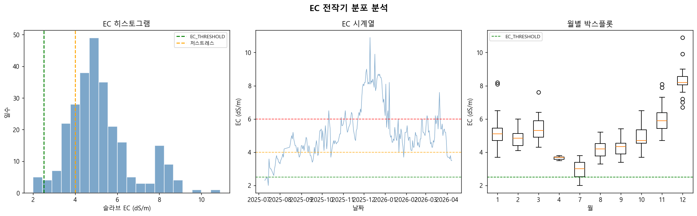

# 01 EC 전작기 분포 분석
생성일: 2026-04-20 18:28

## 1. 기본 통계
| 통계량 | 값 |
|---|---|
| 평균 | 5.19 dS/m |
| 중위수 | 4.90 dS/m |
| 표준편차 | 1.53 |
| 최솟값 | 2.00 |
| 최댓값 | 10.90 |
| IQR (25~75%) | 4.30 ~ 5.80 |
| 유효 데이터 일수 | 266일 |

## 2. EC 구간별 빈도
| 구간 | 일수 | 비중 |
|---|---|---|
| 안전(<=2.5) | 6 | 2.3% |
| 저(2.5-4) | 49 | 18.4% |
| 중(4-6) | 154 | 57.9% |
| 고(6-8) | 31 | 11.7% |
| 극고(>8) | 26 | 9.8% |

## 3. 월별 평균 EC 및 S&V 예측 감소율
| 월 | 평균 EC (dS/m) | S&V 예측 감소율 |
|---|---|---|
| 1월 | 5.26 | 24.8% |
| 2월 | 4.84 | 21.1% |
| 3월 | 5.40 | 26.1% |
| 4월 | 3.66 | 10.5% |
| 7월 | 2.97 | 4.2% |
| 8월 | 4.19 | 15.2% |
| 9월 | 4.30 | 16.2% |
| 10월 | 4.92 | 21.8% |
| 11월 | 5.97 | 31.2% |
| 12월 | 8.30 | 52.2% |

## 4. 핵심 해석
- 전작기 평균 EC 5.19 dS/m (임계값 2.5 dS/m 대비 207%)
- 임계값 초과 비율: 97.7% (S&V 가 영향 줄 여지 충분)
- 고 EC (>4 dS/m) 비중: 79.3%
- EC 변동성 (std=1.53) 은 S&V 효과를 검증하기에 충분한 범위

