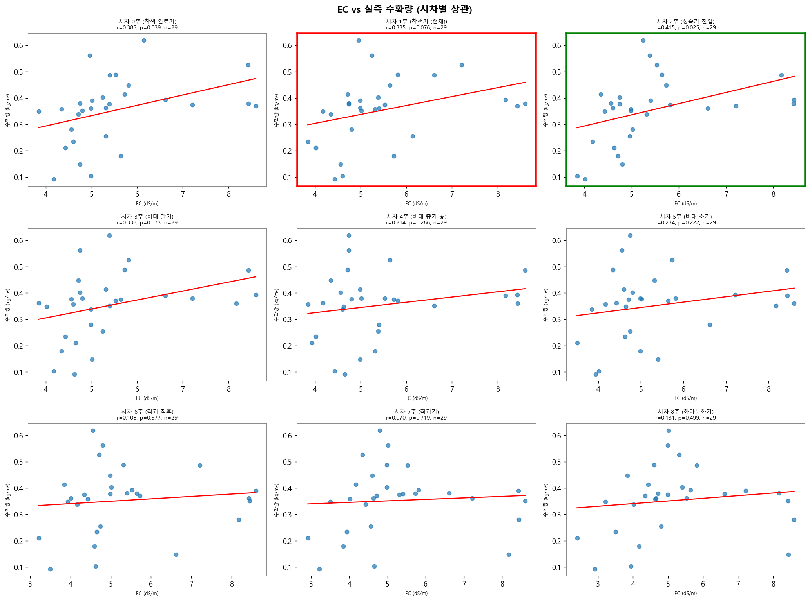

# 02 EC vs 실측 수확량 상관 분석
생성일: 2026-04-20 18:28

## 1. 시차별 Pearson 상관 계수
| 시차 (주) | Pearson r | p-value | n | 생리학적 의미 |
|---|---|---|---|---|
| 0 | 0.385 | 0.039 | 29 | 착색 완료기  |
| 1 | 0.335 | 0.076 | 29 | 착색기 (현재) <- 현재 |
| 2 | 0.415 | 0.025 | 29 | 성숙기 진입  |
| 3 | 0.338 | 0.073 | 29 | 비대 말기  |
| 4 | 0.214 | 0.266 | 29 | 비대 중기 ★  |
| 5 | 0.234 | 0.222 | 29 | 비대 초기  |
| 6 | 0.108 | 0.577 | 29 | 착과 직후  |
| 7 | 0.070 | 0.719 | 29 | 착과기  |
| 8 | 0.131 | 0.499 | 29 | 화아분화기  |

## 2. 최강 상관 시차
- 시차 **2주** (성숙기 진입) 에서 r = **0.415** (p = 0.025)
- 현재 설정 (시차 1주) r = 0.335

## 3. 선형 회귀 (시차 2주)
```
수확량 = 0.124 + (0.042) × EC
```
EC 1 dS/m 증가 시 수확량 0.042 kg/m² 증가

## 4. 해석
- EC 와 수확량의 실직접 상관은 시차 2주 기준 r=0.415
  (통계적으로 유의함, n=29)
- 현재 S&V 설정(시차 1주) 은 최적(2주)과 다름 - 가설 B 참조


