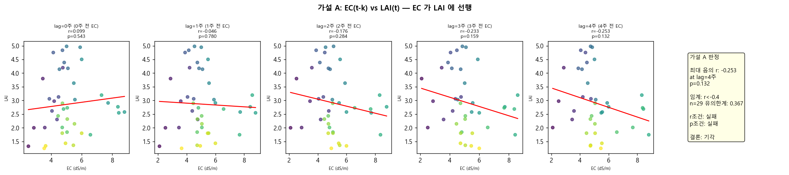

# 03 가설 A 검증: EC -> LAI -> TOMGRO 간접 경로
생성일: 2026-04-20 18:28

## 판정 규칙 (사전 선언)
- 조건 1: EC-LAI 음의 상관 r < **-0.4** (시차 0~4주 중 최솟값)
- 조건 2: p-value < **0.05**
- 경계: r in (-0.4, -0.3) → Borderline
- ⚠ n=29: 통계적 유의 임계 |r| ≈ 0.367

## 검증 결과
| 시차 | Pearson r | p-value | n | 가설 A 기여 |
|---|---|---|---|---|
| 0주 (착색 완료기) | 0.099 | 0.543 | 40 | ✗ |
| 1주 (착색기 (현재)) | -0.046 | 0.780 | 40 | ✗ |
| 2주 (성숙기 진입) | -0.176 | 0.284 | 39 | ✗ |
| 3주 (비대 말기) | -0.233 | 0.159 | 38 | ✗ |
| 4주 (비대 중기 ★) | -0.253 | 0.132 | 37 | ✗ |

## 판정 체크리스트
| 조건 | 임계값 | 실측 | 통과? |
|---|---|---|---|
| 최대 음의 r (시차 0~4주) | < -0.4 | -0.253 | ✗ |
| p-value | < 0.05 | 0.132 | ✗ |
| **가설 A 성립** (AND) | — | — | **✗ 기각** |

## 생리학적 해석
- EC 가 LAI 에 유의한 영향을 미치지 않음
- 가설 A 기각: LAI 는 EC 와 독립적으로 변화. S&V 이중 차감 이외의 원인 탐색 필요

