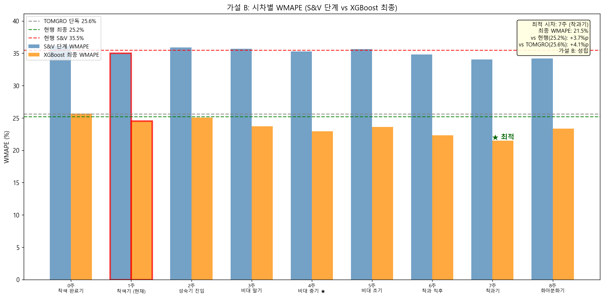

# 04 가설 B 검증: S&V 최적 시차 탐색
생성일: 2026-04-20 18:28

## 판정 규칙 (사전 선언)
- 조건 1: 최적 시차 ≠ 1주 (현재 설정)
- 조건 2: XGBoost 최종 WMAPE 개선폭 vs 현행(25.2%) ≥ **2.0%p**
- 조건 3: XGBoost 최종 WMAPE 개선폭 vs TOMGRO(25.6%) ≥ **2.0%p** (S&V 가 실제 기여 증명)
- 경계: 개선폭 [1.5, 2.0) → Borderline
- Binding 조건: 최종 WMAPE < 23.2%

## 시차별 WMAPE 결과
| 시차 | 생리학적 의미 | S&V WMAPE | 최종 WMAPE ⭐ | n | 비고 |
|---|---|---|---|---|---|
| 0주 | 착색 완료기 | 36.1% | 25.7% | 29 |   |
| 1주 | 착색기 (현재) | 35.0% | 24.5% | 29 | ← 현재  |
| 2주 | 성숙기 진입 | 35.9% | 25.1% | 29 |   |
| 3주 | 비대 말기 | 35.7% | 23.7% | 29 |   |
| 4주 | 비대 중기 ★ | 35.3% | 22.9% | 29 |   |
| 5주 | 비대 초기 | 35.6% | 23.6% | 29 |   |
| 6주 | 착과 직후 | 34.8% | 22.3% | 29 |   |
| 7주 | 착과기 | 34.0% | 21.5% | 29 |  ★ |
| 8주 | 화아분화기 | 34.2% | 23.3% | 29 |   |

## 판정 체크리스트
| 조건 | 임계값 | 실측 | 통과? |
|---|---|---|---|
| 최적 시차 ≠ 1주 | — | 7주 | ✓ |
| 개선폭 vs 현행 최종 | ≥ 2.0%p | 3.7%p | ✓ |
| 개선폭 vs TOMGRO | ≥ 2.0%p | 4.1%p | ✓ |
| **가설 B 성립** (AND) | — | — | **✓ 성립** |

## 최적 시차 생리학적 의미
시차 **7주** = 수확 7주 전 EC = **착과기**

## 해석
가설 B 성립: 시차를 재조정하면 최종 WMAPE 가 개선됨.
현재 설정 (시차 1주) 의 최종 WMAPE 24.5% vs 최적 시차 (7주) 21.5%

