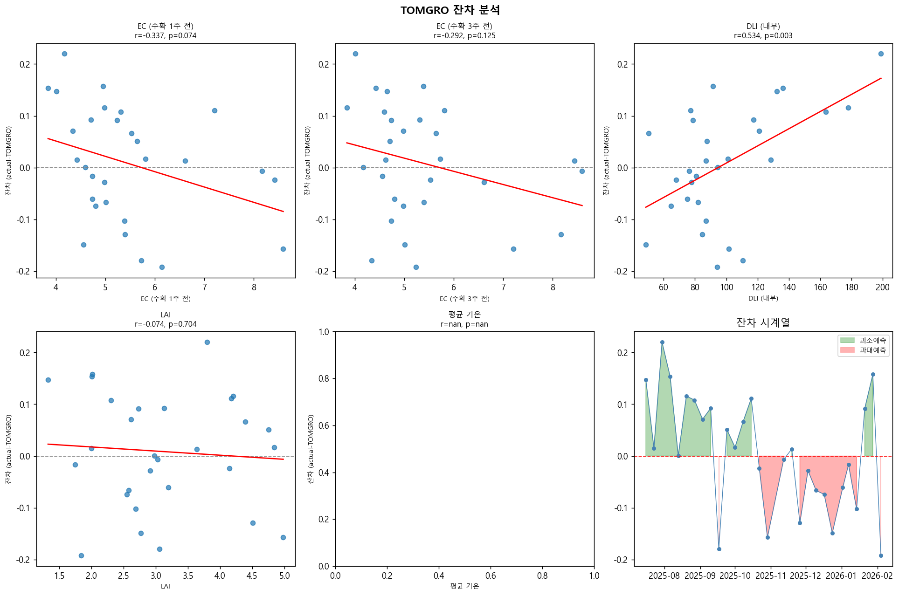

# 05 TOMGRO 잔차 분석
생성일: 2026-04-20 18:28

## 잔차 기본 통계
| 통계량 | 값 |
|---|---|
| 평균 잔차 | 0.009 kg/m² (과소예측 경향) |
| 표준편차 | 0.110 |
| 최솟값 | -0.192 |
| 최댓값 | 0.220 |

## 잔차와 환경 변수 상관
| 변수 | Pearson r | p-value | n | 유의성 |
|---|---|---|---|---|
| EC (수확 1주 전) | -0.337 | 0.074 | 29 | 비유의 |
| EC (수확 3주 전) | -0.292 | 0.125 | 29 | 비유의 |
| DLI (내부) | 0.534 | 0.003 | 29 | 유의 |
| LAI | -0.074 | 0.704 | 29 | 비유의 |

## 해석
- EC (수확 1주 전) 과 잔차 상관: r=-0.337
  → EC 가 TOMGRO 오차를 설명함 (S&V 역할 있음)
- EC (수확 3주 전) 과 잔차 상관: r=-0.292
- 가장 강한 상관 변수: DLI (내부)

