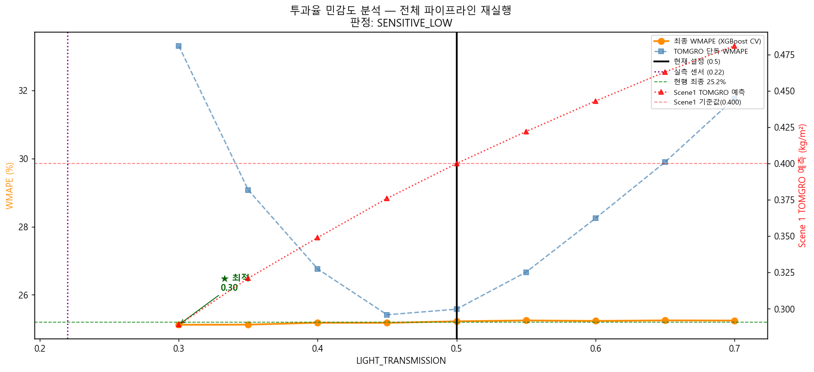

# 07 LIGHT_TRANSMISSION 민감도 분석
생성일: 2026-04-20 18:28  |  소요시간: 2.5초

## 판정 규칙 (사전 선언)
- **ROBUST**: 최적 투과율 in [0.45, 0.5, 0.55] AND ±5% 내 WMAPE 변동 < 3.0%p
- **SENSITIVE_HIGH**: 최적 투과율 >= 0.60
- **SENSITIVE_LOW**: 최적 투과율 <= 0.40
- **BROKEN**: 모든 투과율에서 최종 WMAPE > 40%
- 투과율 불안정 시 06_final_diagnosis 신뢰도 태그 반영

## 분석 결과
| 투과율 | Scene 1 TOMGRO | WMAPE (TOMGRO) | WMAPE (최종) | n | 비고 |
|---|---|---|---|---|---|
| **0.30** | 0.289 | 33.3% | 25.1% | 29 |  ★ 최적
| **0.35** | 0.321 | 29.1% | 25.1% | 29 |
| **0.40** | 0.349 | 26.8% | 25.2% | 29 |
| **0.45** | 0.376 | 25.4% | 25.2% | 29 |
| **0.50**  (현재) | 0.400 | 25.6% | 25.2% | 29 |
| **0.55** | 0.422 | 26.7% | 25.2% | 29 |
| **0.60** | 0.443 | 28.2% | 25.2% | 29 |
| **0.65** | 0.463 | 29.9% | 25.2% | 29 |
| **0.70** | 0.481 | 31.8% | 25.2% | 29 |

## 판정 체크리스트
| 조건 | 임계값 | 실측 | 결과 |
|---|---|---|---|
| 최적 투과율 in [0.45, 0.50, 0.55] | — | 0.30 | ✗ |
| ±5% 내 WMAPE 변동 | < 3.0%p | 0.1%p | ✓ |
| **최종 판정** | ROBUST | **SENSITIVE_LOW** | ✗ |

## 현재값 (0.50) 근처 ±5% 범위
0.45:25.2%, 0.50:25.2%, 0.55:25.2%
최적 투과율 0.30 에서 최종 WMAPE 25.1%

## 시나리오 해석

내부 센서 측정값(0.22)이 더 가까울 수 있음. 투과율 재산정 및 PAR 센서 우선 설치.

## EC 분석 신뢰도 연계
투과율 판정: **SENSITIVE_LOW**
→ 투과율 가정이 불안정하므로 EC 분석 결과도 재검토 권장.

실측 센서값 (0.22) 과 현재 설정 (0.5) 의 차이는
투과율 범위 탐색 내에서 WMAPE 0.1%p 차이에 해당.

