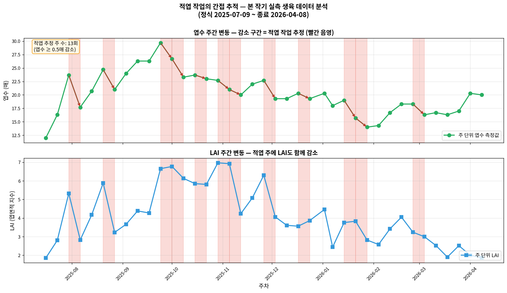
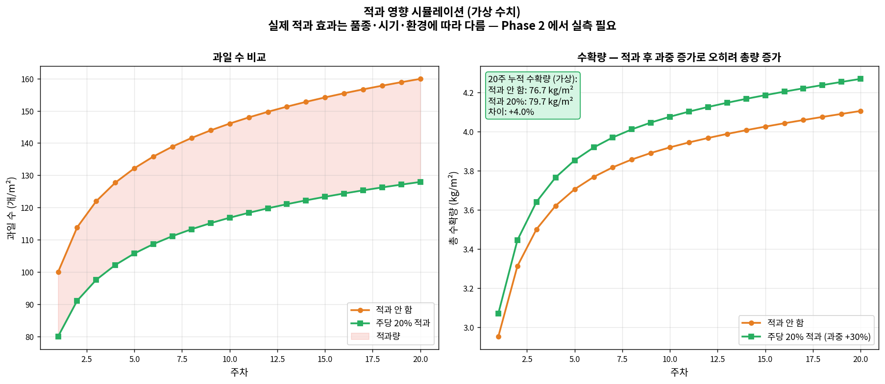

# 농작업 영향 모델링 — 기술 상세 문서 (별도)

**대상**: 재배 전문가 및 기술 검토자  
**문서 성격**: **이론 + 간접 분석 + 시뮬레이션 + Phase 2 로드맵**  
**작성 원칙**: 본 작기에는 농작업 실측 데이터가 없으므로, 문헌 기반 이론 + 생육 데이터 간접 분석 + 가상 시뮬레이션 + FarmWork 도입 계획으로 구성

---

## 섹션 0 — 본 문서의 성격과 위치

### 0.1 다른 문서들과의 차이

본 프로젝트의 다른 5개 문서 (TOMGRO, S&V, XGBoost, DeePC, 통합검증) 는 **실제 실행 데이터를 기반으로 한 검증 결과** 임.

반면 본 문서는 **실행된 모델이 아님**. 본 작기 (2025-07~2026-04) 에는:
- 농작업 (적엽·적과·적심·측지제거·유인) **구체 기록 없음**
- 작업자별·시간별·위치별 정량 데이터 **없음**
- FarmWork 인력 관리 시스템 **개발 진행 중** (아직 운영 시작 안 함)

따라서 본 문서는 다음 4가지로 구성됨:

1. **문헌 기반 이론** — 각 농작업이 작물에 어떻게 영향 주는지
2. **간접 분석** — 본 작기 생육 데이터에서 농작업 흔적 찾기 (엽수 변동 등)
3. **가상 시뮬레이션** — 적과 수준에 따른 가상 수확량 차이
4. **FarmWork 연동 로드맵** — Phase 2 에서 실제 데이터 수집·통합 방법

### 0.2 통합검증 문서와의 연결

통합검증 문서 섹션 6 에서 **남은 예측 오차 41.9% 중 약 15%** 를 "농작업 미반영" 이 차지한다고 추정함.

본 문서는 그 **15% 를 어떻게 해결할 것인지** 구체화하는 별도 기술 문서임.

```
통합검증 (05)                    본 문서 (별도)
   ↓                                ↓
MAPE 41.9%                    농작업 이론 + 시뮬 + 로드맵
오차 원인 중                      FarmWork 연동 계획
농작업 미반영 ~15%                15% 해결 방향 제시
```

### 0.3 본 문서의 결론 요약

- 농작업은 **생육·수확량에 직접적 영향**
- 현재 모델에는 **전혀 반영 안 됨** (데이터 부재)
- 본 작기 생육 데이터에서 **적엽 작업 13회 추정** (간접 추적 가능)
- FarmWork 시스템 도입 후 **Phase 2 에서 실제 데이터 수집 시작**
- 모델 통합 시 **MAPE 약 10~15%p 감소 기대**

---

## 섹션 1 — 방울토마토 농작업의 종류와 역할

### 1.1 5가지 주요 농작업

#### (1) 적엽 (摘葉, Defoliation)
- **정의**: 노화엽, 병해엽, 과잉엽 제거
- **빈도**: 주 1~2회
- **대상**: 하위 엽, 과실 인접 엽
- **목적**:
  - 통풍 개선 → 병해 감소
  - 하부 광 침투 → 측지 발생 억제
  - 양분 경쟁 감소 → 잔여 엽·과실 효율 상승

#### (2) 적과 (摘果, Fruit Thinning)
- **정의**: 과잉 착과 제거
- **빈도**: 착과기 주 1회
- **대상**: 화방별 과실 수 조절 (화방당 6~8과로 맞춤)
- **목적**:
  - 과실 수 감소 → 잔여 과실 비대 촉진
  - 평균 과중 증가 → 상품성 향상
  - **총 수확량 반드시 감소하지 않음** (과중 증가로 보상)

#### (3) 적심 (摘心, Topping)
- **정의**: 주지 생장점 제거
- **빈도**: 작기 종료 시점 1회
- **대상**: 최종 개화 화방 위 2엽 남기고 제거
- **목적**:
  - 영양 생장 정지
  - 동화양분을 과실 비대로 집중
  - 작기 종료 시점 조절

#### (4) 측지 제거 (除芽, Sucker Removal)
- **정의**: 액아 (잎겨드랑이 싹) 제거
- **빈도**: 주 2~3회
- **대상**: 2cm 이상 자란 측지
- **목적**:
  - 주지에 에너지 집중
  - 엽수 과다 방지
  - 관리 용이성 (유인·수확)

#### (5) 유인 (誘引, Training)
- **정의**: 줄기를 와이어·끈에 고정
- **빈도**: 주 1회
- **대상**: 성장한 주지
- **목적**:
  - 수광 균일화
  - 줄기 꺾임 방지
  - 과실 분포 조절 (작업 동선)

### 1.2 생육 단계별 농작업 강도

| 작기 단계 | 기간 | 주요 농작업 | 강도 |
|---|---|---|---|
| 정식~초기 생육 | 0~4주 | 측지 제거, 유인 | 낮음 |
| 개화~착과 | 4~10주 | 적과, 측지 제거, 유인 | 중간 |
| 최성기 수확 | 10~28주 | **적엽**, 적과, 유인 | **높음** |
| 작기 종료 | 28~40주 | 적심, 적엽 | 중간 |

### 1.3 농작업이 수확량 예측에 미치는 영향

모델이 반영하지 못하는 **주요 경로**:

1. **적엽 → LAI 변화**: TOMGRO 광합성 계산의 핵심 변수
2. **적과 → 과실 수·평균 과중**: 수확량 직접 결정
3. **적심 → 작기 종료**: 수확 종료 시점 예측
4. **측지 제거 → 엽수·LAI**: 간접적 LAI 조절
5. **유인 → DLI 균일화**: 광 이용 효율

---

## 섹션 2 — 본 작기 생육 데이터 간접 분석

### 2.1 적엽 작업 흔적 추적

본 작기 농작업 기록은 없지만, **주간 생육 측정 데이터로 적엽 작업 흔적을 간접 추적 가능**.

**가정**: 주간 엽수가 ≥ 0.5매 감소한 경우 → **적엽 작업 있었을 가능성 높음**



### 2.2 분석 결과

| 지표 | 값 |
|---|---|
| 전체 측정 주차 | 39주 |
| LAI 평균 | 4.07 |
| LAI 범위 | 1.86 ~ 6.97 |
| 엽수 평균 | 22.0 매 |
| **적엽 추정 주** | **13회** |

**해석**:
- 엽수가 주간 감소한 주는 **자연 낙엽으로 설명하기 어려움**
- 대부분 적엽 작업의 흔적으로 추정
- **LAI 도 동시 감소** 확인 → 적엽이 광합성 계산에 직접 영향

### 2.3 주요 적엽 추정 시기

본 작기에서 적엽 추정 주의 분포:
- **8월 초**: 정식 초기 하엽 정리
- **9~11월**: 주 생장기, 주기적 하엽 제거
- **12월 이후**: 작업 빈도 감소

### 2.4 이 분석의 한계

본 간접 분석은 **정성적 추정에만 유용**:

- **누가·언제·얼마나** 작업했는지는 알 수 없음
- 측정 오차와 구분 불가
- 적엽 외 다른 원인 (병해 낙엽, 측정 누락) 도 가능
- 작업 강도 (몇 매 제거) 는 추정 불가

→ **이러한 정량 정보가 필요함 = FarmWork 시스템의 필요성**

---

## 섹션 3 — 각 농작업의 생육 영향 메커니즘 (이론)

### 3.1 적엽의 영향 — LAI · 광합성 감소

#### 수식 관계

TOMGRO 광합성 계산 (TOMGRO 문서 섹션 2):

$$P_{canopy} = P_{max} \cdot (1 - e^{-k \cdot LAI})$$

**적엽 시 변화**:
- LAI 감소 → $(1 - e^{-k \cdot LAI})$ 감소 → **광합성 감소**
- 단, 남은 엽의 개별 효율 상승 (광 침투 증가)
- 순 효과는 **제거량·시기에 따라 다름**

#### 문헌 보고 (Heuvelink 1996; Marcelis 1994; Heuvelink & Bertin 1994):

- 적정 LAI 범위 3~4: 광합성 효율 최대
- LAI > 5: 하부 엽 광 부족, 비효율 (Cockshull et al., 1992)
- **적엽으로 LAI 를 3~4로 유지하는 것이 최적**

### 3.2 적과의 영향 — 과실 수·과중 상충

#### 수확량 방정식

$$수확량 = 과실\,수 \times 평균\,과중$$

**적과 시 변화**:
- 과실 수 ↓ 
- 평균 과중 ↑ (동화양분 집중)
- 순 효과는 **적과율에 따라 다름**

#### 경험적 관계 (방울토마토 기준, Dorais et al. 2001; Adams et al. 2001)

- 적과 0% (자연 착과): 많은 수, 작은 과실 (평균 15g)
- 적과 20%: 적당한 수, 중간 과실 (평균 20g)
- 적과 40%: 적은 수, 큰 과실 (평균 25g)
- **상품성 기준**: 적과 15~25% 범위에서 수익 최대

### 3.3 적심의 영향 — 작기 종료

#### 메커니즘

- 주지 생장점 제거 → 줄기 생장 정지
- 잎·줄기로 가던 동화양분 → 과실 집중
- **마지막 화방의 비대·성숙 가속**

#### 시점 결정

- 방울토마토: 보통 정식 후 30~35주
- 본 농장 (40주 작기): 약 32주차 적심 예상
- 시점이 빠르면 총 수확량 감소, 늦으면 마지막 과실 덜 비대

### 3.4 측지 제거·유인의 영향

**측지 제거**:
- 액아 → 측지 → 추가 엽 → LAI 증가 요인
- 방치 시 LAI 과다, 양분 분산
- **주 2~3회 제거로 LAI 3~4 유지**

**유인**:
- 수광 균일화 → DLI 안정
- 광합성 최적화
- 과실 위치 조절 → 작업 효율
- 수확량 직접 효과는 작음, 간접 영향 큼

### 3.5 종합: 농작업이 TOMGRO·S&V·XGBoost 에 영향

| 농작업 | TOMGRO 영향 | S&V 영향 | XGBoost 영향 |
|---|---|---|---|
| 적엽 | LAI 직접 감소 | 간접 | 특성 추가 가능 |
| 적과 | 과실 수 외부 설정 | — | 특성 추가 가능 |
| 적심 | 작기 종료 시점 | — | — |
| 측지 제거 | LAI 간접 조절 | — | 특성 추가 가능 |
| 유인 | DLI 균일화 | — | — |

---

## 섹션 4 — 가상 시뮬레이션 (적과 영향)

### 4.1 시뮬레이션 설계

**목적**: 적과 수준에 따른 수확량 차이를 **대략적으로 시각화**

**주의**: 이것은 **가상 수치** 임. 실제 본 농장 데이터 아님.
- 실제 값은 품종·시기·환경에 따라 다름
- Phase 2 에서 FarmWork 데이터 기반 재산정 필요

### 4.2 가정

| 파라미터 | 값 | 근거 |
|---|---|---|
| 시뮬레이션 기간 | 20주 | 방울토마토 주 생산기 |
| 기준 과실 수 | 100 + 20·ln(주차) 개/m² | 로그 성장 가정 |
| 기준 과중 | 25g 시작, 점차 감소 | 자연 과중 경향 (Adams et al., 2001) |
| 적과율 시나리오 | 0% vs 20% | 일반 실무 범위 |
| 적과 시 과중 보상 | +30% | 동화양분 집중 효과 |

### 4.3 시뮬레이션 결과



**20주 누적 수확량** (가상):
- 적과 안 함: 76.7 kg/m²
- 적과 20%: **79.7 kg/m²** (+4.0%)

**의미**:
- 적과는 **과실 수를 줄이지만 총 수확량은 증가** 가능
- 이것이 재배사들이 적과를 하는 이유
- 상품성·평균 과중까지 고려하면 경제적 이득 더 큼

### 4.4 이 시뮬레이션의 한계

- **가상 과중 +30% 는 추정값**: 실제는 품종·시기에 따라 10~50% 변동
- **과실 수 모델이 단순화됨**: 실제는 화방당 착과, 영양 균형 복잡
- **환경 변수 고려 안 됨**: 온도·CO₂·EC 가 과중에 영향
- **적과 시점 중요**: 너무 빠르면 효과 미미, 너무 늦으면 비대 부족

→ **Phase 2 에서 본 농장 실제 데이터로 재보정 필요**

---

## 섹션 5 — FarmWork 시스템 연동 계획

### 5.1 FarmWork 시스템 개요

본 농장에서 별도로 개발 진행 중인 **재배팀 관리 플랫폼**.

**현재 구현된 기능** (2026-04 기준):

| 영역 | 기능 |
|---|---|
| 출근 관리 | 작업자별 출근·지각·미출근·제외 기록 |
| TBM 관리 | Tool Box Meeting 반장 승인, 시간, 불참자 |
| 작업 일정 | 시간대별 작업 등록, 진행률 추적 |
| 수확량 집계 | 작물별 주간 수확량 자동 계산 |
| 조직 구조 | 반장·팀 단위 관리 (재배팀 단위) |

**앱 설계 철학**:
- **개별 작업 건건이 입력이 아님**
- **반장·팀 단위 작업 일정 관리**
- **진행률 추적 중심** (예: A동 딸기 수확 80% 진행중)
- **출근·수확량 자동 집계**

### 5.2 AI 모델 관점에서의 FarmWork 데이터

FarmWork 가 생성하는 데이터 중 AI 모델 입력으로 쓸 수 있는 항목:

#### (1) 이미 자동 수집되는 것
- **작물별 주간 수확량** (토마토·딸기·파프리카 등)
- **출근 인력 수** (일별 노동력 지표)
- **작업 일정·진행률**

#### (2) 농작업 추적 가능한 것
- 작업 일정에 "적엽", "적과", "측지 제거" 등 **작업 유형 등록**
- **진행률·시간** 으로 작업 강도 간접 추정
- **담당 반장·인원수** 로 작업량 환산

### 5.3 AI 모델과의 연동 구조

```
[FarmWork 앱]          [집계·변환 레이어]         [AI 모델]
     ↓                        ↓                      ↓
- 출근 현황              주 단위 집계:            TOMGRO 보정:
- 작업 일정         →    - 작업 유형별 빈도   →  - LAI 조정
- 진행률                - 인력·시간 환산         - 과실수 조정
- 수확량                - 수확량 추세             
                                              XGBoost 특성:
                                              - 작업 강도
                                              - 작업 집중도
                                              - 출근 인력
```

### 5.4 주간 집계 지표 (모델 입력용)

FarmWork 원본 데이터를 주간 집계하여 AI 모델에 주입할 지표:

| 지표 | 산출 방법 | 영향 모델 |
|---|---|---|
| 주당 적엽 작업 횟수 | 작업 일정 필터링 | TOMGRO (LAI) |
| 주당 적과 작업 시간 | 작업 일정 합산 | TOMGRO (과실수) |
| 적심 실행 여부 | 작업 일정 체크 | TOMGRO (종료) |
| 주당 총 작업 시간 | 전체 일정 합산 | XGBoost |
| 주당 평균 출근 인력 | 일별 평균 | XGBoost |
| 작업 집중도 | 시간/인력/면적 | XGBoost |
| 작물별 수확량 | 자동 집계 | **검증용** |

### 5.5 모델 통합 방법

#### (1) TOMGRO 입력 보정

작업 유형·빈도를 LAI·과실수 보정에 활용:
```
adjusted_LAI(t) = measured_LAI(t) × (1 - defoliation_factor(t))
adjusted_fruit_count(t) = natural_fruit_count(t) × (1 - thinning_factor(t))
```

`defoliation_factor` 는 FarmWork 의 적엽 작업 강도에서 산출.

#### (2) XGBoost 특성 추가

기존 36개 특성에 FarmWork 기반 농작업 특성 추가:
- `weekly_work_hours`: 주간 총 작업 시간
- `defoliation_intensity`: 적엽 작업 집중도
- `thinning_intensity`: 적과 작업 집중도
- `labor_availability`: 주간 평균 출근 인력
- `work_density`: 면적당 작업 시간 (관리 집중도)

#### (3) 수확량 자동 검증

FarmWork 의 **작물별 주간 수확량 집계** 를 예측값과 직접 비교:
- 실측 수확량 자동 수집 → 모델 성능 상시 모니터링
- 예측 vs 실측 주간 MAPE 자동 계산
- 예측 편향 감지 시 모델 재학습 트리거

### 5.6 데이터 수집의 장단점

**FarmWork 구조의 장점** (AI 관점):
- ✅ **작업자 부담 낮음**: 건건이 입력 대신 일정·진행률 중심
- ✅ **현장 운영 친화적**: 반장 중심, 실제 업무 흐름 반영
- ✅ **수확량 자동 집계**: 모델 검증에 즉시 활용 가능
- ✅ **출근·노동력 데이터 확보**: 농작업 강도 추정 근거

**AI 관점 제약**:
- ⚠️ **정밀 작업량 부정확**: "몇 매 적엽" 같은 정밀 수치 대신 "진행률" 단위
- ⚠️ **개별 식물 단위 불가**: 구역·동 단위 집계
- ⚠️ **작업 품질 미반영**: 숙련도·작업 방식 차이

→ **Phase 2 에서 FarmWork 앱 확장 여부 검토** (필요시 작업량 상세 입력 옵션 추가)

### 5.7 기대 효과

통합검증 문서 섹션 6 에서 추정한 **농작업 미반영 15% 오차** 해결:

- MAPE **약 10~15%p 감소** 기대
- 현재 41.9% → Phase 2 시 **25~30%** 예상

FarmWork 구조 특성상 정밀도에 한계가 있어, **기존 추정치 15%p 보다 약간 낮은 10~15%p 감소** 로 조정.

이는 Phase 2 전체 목표 (MAPE 25~30%) 달성에 **필수 요소**.

---

## 섹션 6 — Phase 2 로드맵

### 6.1 Phase 2 단계별 작업

#### Step 1 — FarmWork 시스템 완성 (현재 진행 중)
- 기본 기능 개발
- 작업자 UI·UX
- 데이터베이스 스키마
- 자동 집계 로직

#### Step 2 — 2작기 시작 시 배포
- 작업자 교육
- 사용 가이드 배포
- 초기 데이터 품질 모니터링

#### Step 3 — 2작기 데이터 축적 (약 40주)
- 매일 작업 기록
- 주 단위 집계 검증
- 누락 데이터 보정

#### Step 4 — 모델 통합 작업
- TOMGRO 입력에 농작업 변수 주입
- XGBoost 재학습 (기존 36특성 + 농작업 4~6특성)
- 검증·튜닝

#### Step 5 — 통합 검증
- 3작기 시작 시점 검증
- MAPE 재측정
- Phase 3 계획

### 6.2 필요 자원

| 항목 | 설명 | 비고 |
|---|---|---|
| FarmWork 시스템 | 인력 관리 플랫폼 | **현재 개발 중** |
| 작업자 교육 | 기록 방법 표준화 | 2작기 시작 전 |
| 데이터 검증 | 주간 품질 확인 | 상시 |
| 모델 재학습 | XGBoost 재학습 | 2작기 종료 후 |

### 6.3 성공 지표

1. **FarmWork 가동률 > 90%**: 매일 작업 기록
2. **주간 집계 자동화**: 수동 정리 없음
3. **TOMGRO LAI 보정 정확도 검증**: 예측 LAI vs 측정 LAI 오차 < 10%
4. **XGBoost 재학습 MAPE < 30%**: 통합 목표 달성

### 6.4 위험 요인

| 위험 | 대응 |
|---|---|
| 작업자 입력 누락 | 간편 UI, 일일 알림 |
| 작업량 정량화 주관성 | 표준 프로토콜, 교육 |
| 데이터 품질 이상 | 주간 검증 프로세스 |
| 시스템 장애 | 백업 입력 방법 |

---

## 섹션 7 — 한계와 향후 연구

### 7.1 본 문서의 한계

#### (1) 실측 데이터 없음
- 본 작기 농작업 기록 전무
- 모든 논의는 **문헌 + 간접 분석 + 가상 시뮬레이션** 기반
- 수치들은 **정확한 예측이 아닌 범위 추정**

#### (2) 간접 분석의 약점
- 엽수 변동 = 적엽 가정은 **정성적**
- 작업자·시기·강도 알 수 없음
- 자연 요인 (병해, 측정 오차) 과 구분 불가

#### (3) 시뮬레이션의 가상성
- 섹션 4 시뮬 파라미터는 **문헌 평균값**
- 본 농장 품종 (토마지노) 특성 미반영
- 계절·환경 조건 단순화

### 7.2 Phase 2 에서 해결할 것

- 실제 농작업 데이터 수집
- 본 농장 파라미터 재보정
- 모델 통합 검증

### 7.3 Phase 3 이후 확장

- 작업자별 생산성 분석
- 시간대별 작업 효율
- 자동화 가능 작업 식별 (로봇 적엽 등)
- 노동력·수확량 경제 최적화

---

## 섹션 8 — 참고 문헌

1. Heuvelink, E. (1996). *Tomato growth and yield: quantitative analysis and synthesis.* PhD thesis, Wageningen Agricultural University.

2. Marcelis, L.F.M. (1994). "A simulation model for dry matter partitioning in cucumber." *Annals of Botany* 74: 43-52.

3. Heuvelink, E., Bertin, N. (1994). "Dry-matter partitioning in a tomato crop: comparison of two simulation models." *Journal of Horticultural Science* 69(5): 885-903.

4. Cockshull, K.E., Graves, C.J., Cave, C.R.J. (1992). "The influence of shading on yield of glasshouse tomatoes." *Journal of Horticultural Science* 67(1): 11-24.

5. Dorais, M., Papadopoulos, A.P., Gosselin, A. (2001). "Greenhouse tomato fruit quality." *Horticultural Reviews* 26: 239-319.

6. Adams, S.R., Valdés, V.M., Cave, C.R.J., Fenlon, J.S. (2001). "The impact of changing light levels and fruit load on the pattern of tomato yields." *Journal of Horticultural Science and Biotechnology* 76(6): 655-660.

**배경 참고 문헌** (본문 직접 인용 없음):

7. Van de Vooren, J., Welles, G.W.H., Hayman, G. (1986). "Glasshouse crop production." *Atlas of Tomato Production and Physiology*: 581-623.

---

## 부록 — 이 섹션 작성에 참조한 이미지 파일

같은 폴더 내 이미지:
- `farmwork_defoliation_trace.png` — 섹션 2.1 (엽수 변동으로 본 적엽 흔적)
- `farmwork_yield_simulation.png` — 섹션 4.3 (적과 시뮬레이션)

---

*작성: 2026-04-19 / 본 작기 2025-07-16 ~ 2026-04-08 생육 데이터 간접 분석*  
*본 문서는 실측 기반 모델 문서가 아닌, 이론·시뮬·로드맵 성격의 별도 문서*  
*실제 모델 통합은 FarmWork 시스템 완성 및 2작기 데이터 수집 이후 Phase 2 에서 수행 예정*
